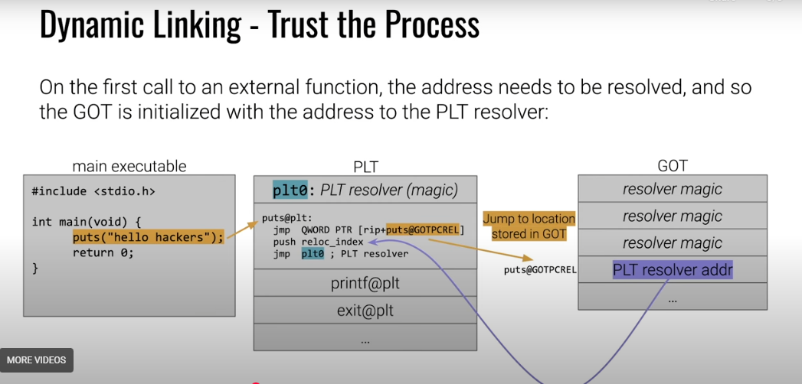

# GLOBAL OFFSET TABLE (GOT) & PROCEDURE LINKAGE TABLE (PLT)

- there are two types of linking the gcc compiler does: static linking and dynamic linking
- static linking: all the code for the libraries used in the program is copied into the executable at compile time
- dynamic linking: the code for the libraries is not copied into the executable, instead the code is loaded from shared libraries at runtime.
- dynamic linking is more efficient because it reduces the size of the executable and allows multiple programs to share the same library code in memory.
- however, dynamic linking introduces some overhead because the program has to look up the addresses of the library functions at runtime.
- How dynamic linking works is basically handled by two features : the Global Offset Table (GOT) and the Procedure Linkage Table (PLT).

- The PLT contains the assembly instructions that are used to call external functions from libc or other libs.
- the got is an array for addresses or pointers that the PLT uses to call external functions.
- When a program is compiled with dynamic linking, the compiler generates a PLT entry for each external function that the program calls.
- Each PLT entry contains a jump instruction that jumps to the address stored in the corresponding GOT entry.
- Initially, the GOT entries for external functions point to the next instruction in the PLT entry, which is a call to the dynamic linker.
- When the program calls an external function for the first time, the dynamic linker is invoked.

## How can we use this Binary Exploitation?

- By overwriting the GOT entry of a function with the address of another function, an attacker can redirect the program's execution flow to the desired function.
- For example, an attacker can overwrite the GOT entry of the `exit` function with the address of the `system` function, allowing them to execute arbitrary commands when the program attempts to exit.
- this is called as ret2libc attack.
- Another way to exploit the GOT is by overwriting the GOT entry of a function with the address of shellcode injected into the program's memory.
- Partial RELRO allows the GOT to be modified, while Full RELRO makes the GOT read-only after the dynamic linker has resolved all the symbols.
- NO RELRO means that the GOT is writable throughout the program's execution, making it vulnerable to GOT overwrite attacks.

- overwriting shellcode in GOT doesnt work if NX bit is enabled.
- so ret2libc along with ROP is the most common way in CTFS to get flags.

### Full flow

Lets say an executable calls the `puts` function from libc to print a string to the console.

1. When the program is compiled, the compiler generates a PLT entry for the `puts` function and a corresponding GOT entry.
2. The GOT entry for `puts` initially points to the next instruction in the PLT entry, which is a call to the dynamic linker.
3. When the program calls `puts` for the first time, the dynamic linker is invoked.
4. The dynamic linker looks up the address of the `puts` function in the shared library and updates the GOT entry for `puts` with the correct address.
5. The dynamic linker then jumps to the address of `puts` in the shared library, and the function is executed.
6. On subsequent calls to `puts`, the PLT entry jumps directly to the address stored in the GOT entry, bypassing the dynamic linker and improving performance.

### Diagram 

### References

https://pwn.college/program-security/program-security/
