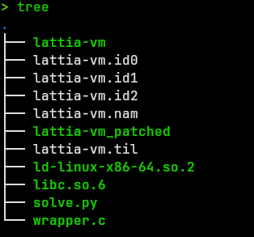
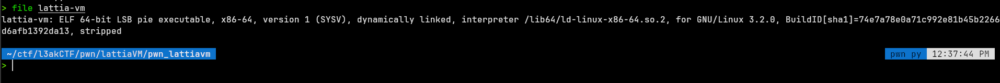
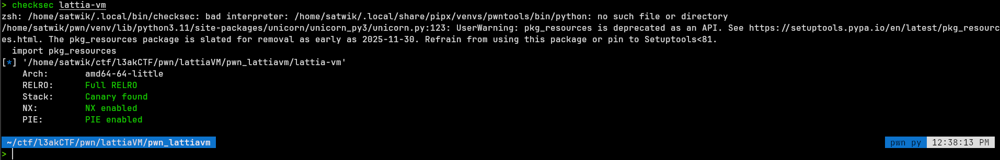
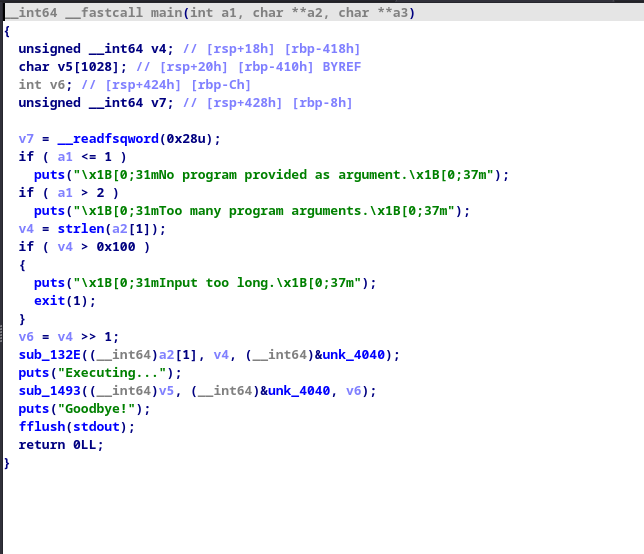
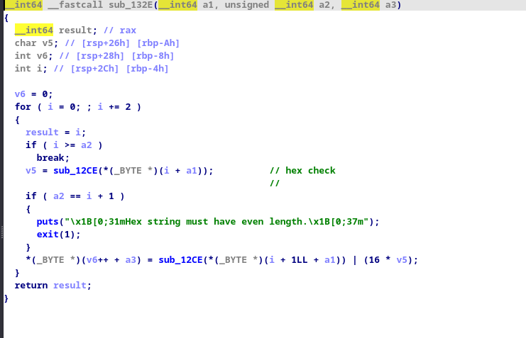
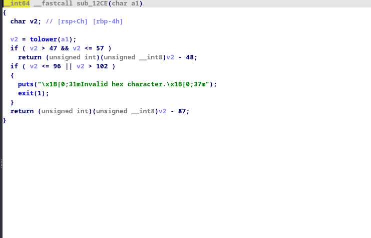

# Lattia VM 1

- after getting skill issued in piet, im starting lattia vm.

lets see what we have :



- ran pwninit and opened it in ida alr but lemme doocument the initial stuff asw below :




- standard stuff, all prots on.
- sadly its stripped which pmo

aight lets look at the wrapper function :


```c
#include <stdio.h>
#include <stdlib.h>
#include <string.h>
#include <unistd.h>
#include <sys/wait.h>

#define MAX_HEX 257

int main(void)
{
    char buf[MAX_HEX + 1]; 

    puts("Welcome to LattiaVM!");

    printf("Input hex-encoded bytecode (no more than 256 hex chars):\n");
    fflush(stdout);

    if (!fgets(buf, sizeof(buf), stdin))
        return 0;
    buf[strcspn(buf, "\n")] = '\0';

    pid_t pid = fork();
    if (pid == 0)
    {
        freopen("/dev/null", "r", stdin);
        char vm[] = "/app/lattia-vm";
        execl(vm, vm, buf, NULL);
        perror("execl");
        _exit(1);
    }
    waitpid(pid, NULL, 0);

    return 0;
}
```


- if you know, 2 hex values = 1 byte, so looks like the vm accepts 128 bytes (havent rev'd the vm yet so need to see if smth can be done later).

- rest fo the code is pretty simmple, it forks the vm with input as the arg and waits for it to finish and calls `_exit(1)` (_exit doesnt do exit handling like exit()) so ntg can be done with the wrapper binary itself maybe.

- whats interesting is that it sets the stdin of vm to /dev/null which technically can be fixed by calling dup2 or some file struct shenanigans but we have to see but idk for now why its there

! fun fact they added exit handler command in the new pwndbg update :> - check out my other blogs for extensive exit handler writeups/research or wtv.


# reversing the vm




ida resolved main, cool cool

- `char v5[1028]; // [rsp+20h] [rbp-410h] BYREF`

- there is a char[1028] array which is prolly the stack.

- some error handling stuff then the input is passed into sub_132E

## SUB_132E



this converts our hex string into bytecode and stores it in v6 by iterating thru the string and calling sub12ce.

### sub12ce



- ts just a hex string to number converter, ntg sussy other than maybe exit but ehh error handler

lets do a raw pass -

if we pass "ab2a" as input, it converts to [0xab, 0xcd] and stores it in v6

- but yea it just converts stuff.
- we will goof around with the check later after maybe rev'ing the opcodes.

## SUB_1493

- next it calls 1493 to execute the instructions.
- this time it passes the char array v5 also, i think its the stack but we have to see 

- function is pretty big so ill only provide relevant ss.


- ok so * (v5 + 1024) is being set to 0.

- hmmm if we are assuming its a stack based vm, then zeroing out last 4 bytes tells us its a 32bit stack vm and MAYBE the last 4 bytes are the stack ptr.

i had solved a similar vm challenge in idek ctf 2025 where it was a stack based vm so im just guessing for now.


